# WinDeploy Studio

Windows desktop toolkit for Windows/Linux installation media, portable Windows To Go workspaces, native drive benchmarks, image resources, diagnostics, logs, and AI-assisted deployment help.


## Overview

WinDeploy Studio v2.1.0 is the production Windows desktop application for practical Windows and Linux deployment workflows. It combines Windows installation media creation, Linux ISOHybrid writing, Windows To Go, native drive testing, trusted image source navigation, deployment utilities, logs, an interactive first-run tour, and clear safety notices for advanced tools.

The project is distributed under the MIT License.

## Verification Status

The following areas have completed functional verification and are treated as
the frozen baseline for the next validation cycle:

- First-run App Tour, including complete and single-section replay, free
  exploration, secondary-page navigation, and return-to-parent behavior.
- Image Center, disk benchmark/history, Disk Tools, logs, AI Assistant, Tools,
  Settings, localization, and shared navigation.

Windows/Linux installation media and Windows To Go creation remain the
only areas awaiting the next round of real-device validation. Their deployment
logic is intentionally kept separate from the verified baseline; do not infer
hardware-level success from UI or automated tests alone. Any future change to
shared services must be regression-tested against the frozen areas before it is
accepted.

## Highlights

- **Installation Media Creator**
  - Create Windows installation USB drives and write bootable Linux ISOHybrid images.
  - Use a normal installation ISO for this workflow: Windows media must contain the standard Setup/WIM layout, while Linux media must be the distribution's ordinary bootable installer image. WinPE/recovery-only images are not accepted as normal Windows installation media.
  - Parse Windows ISO images and list available editions.
  - Select UEFI + GPT, UEFI + MBR, or Legacy BIOS for Windows media, with a preferred partition drive letter and custom volume label/icon.
  - Validate Linux ISOHybrid images before erasing the target disk and show only the Legacy BIOS, UEFI, and standard EFI fallback CPU architectures detected in the selected image.
  - Linux media is a byte-for-byte ISOHybrid write. It preserves the ISO's own partition and boot layout; it does not convert UEFI/MBR/Legacy boot modes and does not create a persistence or remaining-space partition. Secure Boot compatibility depends on the image signature and target firmware, so it is reported neither inferred nor guaranteed.
  - Some firmware lists the same Linux USB twice because the image exposes multiple boot paths or the firmware enumerates one device more than once. The two names do not mean two copies were written. For any distribution, choose the entry that opens its normal installer; if one entry opens `grub>`, shows a blank screen, or cannot continue, return to the boot menu and try the similar USB entry. Prefer an entry explicitly marked UEFI when the computer is using UEFI mode.
  - Bind every destructive operation to the selected external disk and revalidate it immediately before writing.

- **To Go Workspace Creator**
  - Create portable Windows To Go workspaces.
  - Code-level image recognition and deployment-mode availability follow this matrix for standard compatible images:

    | Image family | Direct | VHD | VHDX | Notes |
    |:---|:---:|:---:|:---:|:---|
    | Windows 7 | Yes | Enterprise/Ultimate only | No | Best effort. Boot mode is derived from the ISO; original media without a verified x64 UEFI fallback is restricted to Legacy BIOS. Matching legacy drivers and updates may be required. |
    | Windows 8 | Yes | Yes | Yes | Best effort. VHD/VHDX become available after the image is identified; matching drivers and updates may still be required. |
    | Windows 8.1 | Yes | Yes | Yes | Best effort. WIMBoot remains a direct-deployment-only option; matching drivers and updates may still be required. |
    | Windows 10/11 | Yes | Yes | Yes | Current verified normal creation scope. CompactOS is available only for these generations. |
    | Windows Server | Yes | Yes | Server 2012+ only | Best effort. Server 2008 R2 supports VHD but not VHDX; Server 2012 and later support both. Client-only options are excluded. |

    The matrix describes code-level image recognition and deployment-mode availability. The currently verified Windows To Go production scope is Windows 10 and Windows 11 on compatible hardware and standard images. Windows 7, Windows 8, Windows 8.1, and Windows Server may be recognized and attempted, but are not guaranteed to boot on every computer or firmware mode. Older systems commonly require version- and hardware-matched USB, chipset, storage, and boot drivers, required updates, or additional boot/repair tools. Prepare those resources before writing, test on the intended computer, and keep important data backed up elsewhere.
  - Windows To Go accepts normal Windows installation ISO layouts containing `boot.wim` and `install.wim` or `install.esd`. WIMBoot additionally requires `install.wim`; split `install.swm` images and images missing required BIOS/EFI boot files are rejected before the target disk is changed.
  - Portable Linux workspaces are planned for a future release and are not available in the current version. Use Linux Installation Media to create a bootable Linux installer today.
  - Use a five-step image, disk, deployment, advanced-options, and summary workflow before execution.
  - Select UEFI + GPT, UEFI + MBR, or Legacy BIOS and deploy Windows directly or into dynamic/fixed VHD/VHDX files; incompatible image and mode combinations are blocked before writing. The selection controls the disk layout, not the target firmware: use UEFI + GPT for modern UEFI firmware, select UEFI + MBR only when that firmware explicitly supports MBR booting, and use Legacy BIOS only on traditional BIOS hardware.
  - Configure local-disk visibility, simplified first-run settings, UASP, CompactOS, WIMBoot, VHD/VHDX drive-letter repair, .NET Framework 3.5, and deployment drive letters where supported. “Simplify first-run setup” uses supported unattended settings to hide selected pages; it does not promise to bypass every OOBE step or switch Windows into Audit Mode. WinRE is preserved; offline removal is not offered because custom recovery layouts cannot be safely assumed.
  - UASP disabling is an expert troubleshooting setting only. Use it only after confirming that the USB bridge can fall back to BOT; an UAS-only device can lose access to its own boot drive. CompactOS is available only for Windows 10/11 client images and trades lower disk usage for longer deployment and additional I/O overhead. .NET Framework 3.5 is enabled offline only from `sources\\sxs` in the selected ISO; the source must match the target image’s version, architecture, and language.
  - Optionally inject Windows INF drivers offline.
  - Build a separate Windows boot partition and verify BCD, virtual-disk binding, and fallback UEFI boot files.
  - Revalidate disk identity, capacity, model, and bus type before destructive operations, preferring a reliable hardware serial number and failing closed when no stable identity is available.
  - During image application, the progress panel shows reliable elapsed time only.

- **Native Drive Benchmark**
  - Uses unbuffered, write-through native Windows I/O instead of cached file-copy estimates.
  - Measures sequential read/write, 4K random read/write, real multi-thread scaling, mixed workloads, latency percentiles, and optional full-write stability.
  - Provides Quick, Standard, Extreme, and Full Write modes with live line charts, cache-behavior analysis, and practical To Go suitability guidance.
  - Automatically saves successful results for detail review, date filtering, two-run comparison, deletion, and CSV/JSON export.
  - Lets users choose one or more saved records when asking the AI whether a USB is suitable for a To Go workspace; selected metrics and their meanings are sent as reviewable plain text.
  - When no saved record is selected, the AI request recommends a Standard disk test before reaching a confident To Go suitability conclusion.
  - Uses an ownership marker for temporary data and removes only files created by the current test.

- **Disk Tools**
  - Collect read-only disk identity, health, reliability, lifetime, temperature, wear, and NVMe telemetry through a bounded native helper. Slow or unsupported storage queries become explicit unavailable values or collection warnings instead of blocking the whole scan.
  - Runs the bounded native helper from the elevated application process, so an unresponsive device produces a bounded failure instead of leaving the diagnostic screen stuck.
  - Repair UEFI or BIOS boot files only on a revalidated external, non-system disk, with preflight checks, a typed confirmation, BCD backup, no formatting, post-repair verification, and technical logs.

- **Image Center**
  - Separates **Official Microsoft Images**, **Community Editions**, and **Enterprise & LTSC Builds**.
  - Official Windows 10 and Windows 11 entries open Microsoft's official download pages in the system browser.
  - Community images provide China and Global Mirror download choices where available.
  - Enterprise and LTSC entries are marked as expert-level deployment resources with clear source and language notices.
  - StarValleyX is shown only for Simplified Chinese and Traditional Chinese UI languages.
  - The CJK font pack is also Chinese-only. It is offered for Tiny10, Tiny11, and Windows X-Lite, never for StarValleyX.

- **Toolbox**
  - Curated deployment, diagnostics, recovery, hardware, network, and optimization utilities.
  - Tool safety levels: Beginner, Advanced, and Expert.
  - Professional notices before opening advanced, expert, or activation-related utilities.
  - Includes Microsoft Sysinternals Suite.

- **AI Assistant**
  - Built-in AI assistant for Windows deployment questions, log analysis, and troubleshooting suggestions.
  - For USB suitability questions and USB analysis, users can select multiple saved disk-test records. The request includes device data, run parameters, workload measurements, raw sample points, and metric definitions in plain text.
  - Displays a clear AI-generated content notice before use.
  - Applies the same local output-safety policy to the built-in service and every custom endpoint. Provider text and source titles are buffered until the complete response passes client-side screening; blocked political, sexual, violent, hateful, extremist, illegal-drug, gambling, or explicit criminal content is never streamed into the conversation.
  - Supports any OpenAI-compatible HTTPS service endpoint configured by the user.
  - Lets users enter an API Key, keep it protected with Windows user-level encryption, and choose a model manually or from the endpoint's `/models` list.
  - Sends credentials only to the explicitly configured endpoint; the built-in service never receives a user-provided API Key. Changing or resetting the endpoint clears the saved key.

- **Log Center**
  - Centralized logs for installation media creation, To Go workspaces, image operations, downloads, updates, AI, and errors.
  - Quick log browsing and folder access.

- **Interface And Navigation**
  - Uses one consistent Windows 11-inspired interface across supported Windows 10 and Windows 11 hosts.
  - Groups primary navigation with clear visual dividers; choosing a primary destination from Disk Tools or test-history secondary pages opens that destination rather than retaining the previous subpage.
  - Includes a production App Tour that starts automatically on first launch and once after each application version update. It highlights real navigation targets, explains each workspace and its secondary pages, then collapses into a compact guide while leaving the page interactive.
  - Lets users skip a section or end the complete tour, confirms cross-section changes, and keeps the highlighted target sharp while the surrounding workspace is de-emphasized.
  - Provides **Settings > App Tour** controls for replaying the complete tour or one selected section. A selected-section replay uses a focused end-tour flow instead of silently switching to another section.
  - Provides **Settings > Feedback**, which opens the project's [GitHub Issue form](https://github.com/intelfans/WinDeployStudio/issues/new). A **Report this failure** action is also shown after a genuine Installation Media or To Go creation failure; successful operations and user-requested cancellations do not trigger it.

- **International UI**
  - Supports 11 languages:
    - Simplified Chinese
    - Traditional Chinese
    - English
    - Japanese
    - Korean
    - German
    - French
    - Spanish
    - Portuguese
    - Russian
    - Arabic
  - App Tour controls, section guidance, exit confirmations, and Settings replay controls follow the selected UI language across all 11 languages.
  - The AI Assistant requests answers in the selected UI language, keeps Simplified and Traditional Chinese separate, and uses one provider-neutral product-knowledge prompt so feature guidance stays consistent across languages.

## Screenshots

These 18 screenshots follow the left navigation and the main workspace in order. They show the Home page first, then image and deployment workflows, disk utilities, logs, AI, tools, and settings.

### 1. Home

Home is the starting point of WinDeploy Studio. It combines the product title, Quick Start entry points, Workspace content, and project information without forcing users through a separate landing page.

<table>
  <tr>
    <td width="50%">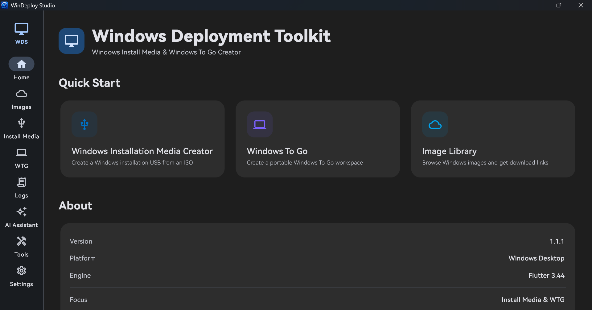<br><sub><b>1. Home</b> - Product title, Quick Start entry points, and the Workspace overview.</sub></td>
    <td width="50%">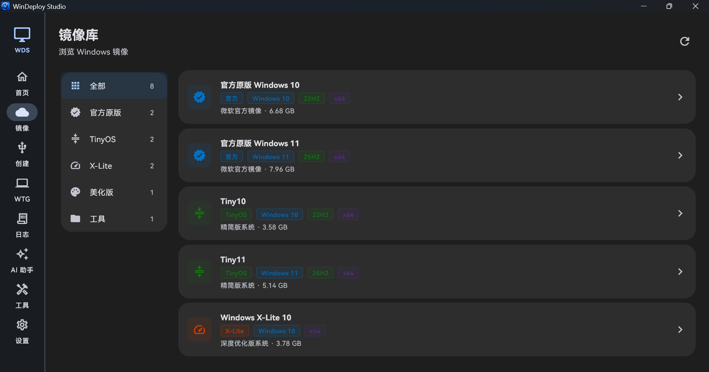<br><sub><b>2. About</b> - Version, platform, license, repository, and project acknowledgement information.</sub></td>
  </tr>
</table>

### 2. Image Library

The Image Library keeps official images, community editions, enterprise and LTSC builds, and supporting resources clearly separated. Each entry communicates its source, purpose, language support, and suitability before a user follows a download link.

<table>
  <tr>
    <td>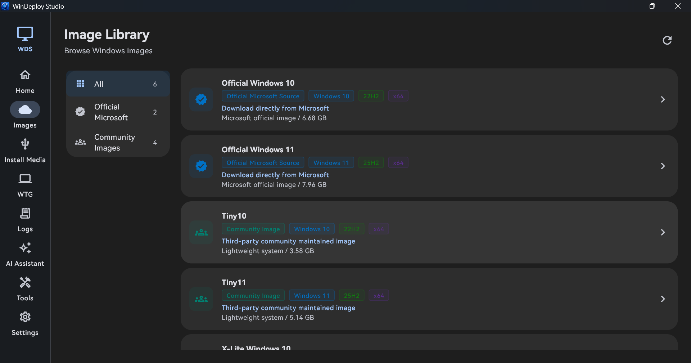<br><sub><b>3. Image Library</b> - Browse categorized image resources with clear source and suitability information.</sub></td>
  </tr>
</table>

### 3. Installation Media

Windows and Linux installation media are distinct workflows. Both make the selected ISO, target disk, validation result, and destructive action clear before writing begins.

<table>
  <tr>
    <td width="50%"><br><sub><b>4. Windows Installation Media</b> - Select and validate a Windows ISO, choose an edition and target disk, then create bootable installation media.</sub></td>
    <td width="50%">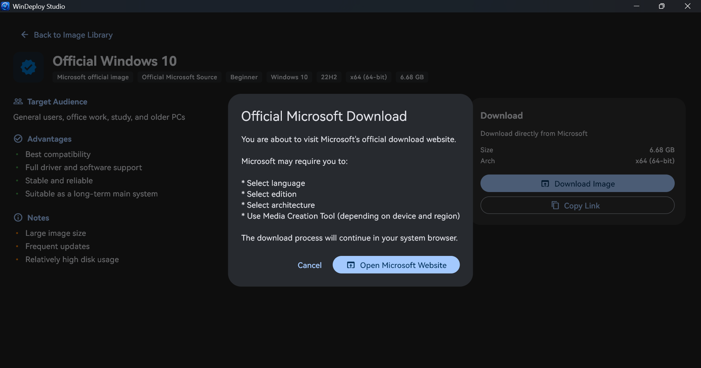<br><sub><b>5. Linux Installation Media</b> - Validate a Linux ISOHybrid image, review the target disk, and write a bootable Linux installer.</sub></td>
  </tr>
</table>

### 4. Windows To Go Workspace

The To Go area creates portable Windows workspaces. It keeps the chosen image, target disk, compatibility checks, options, and confirmation summary together before a destructive operation starts. Portable Linux workspaces are planned for a future release.

<table>
  <tr>
    <td>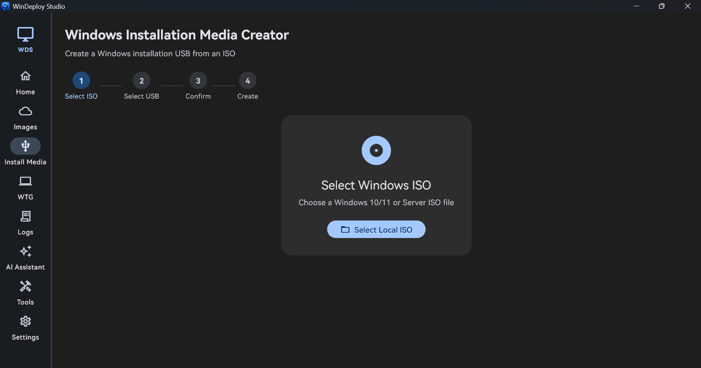<br><sub><b>6. Windows To Go</b> - Create a portable Windows workspace with image, disk, and deployment options shown in one workflow.</sub></td>
  </tr>
</table>

### 5. Disk Utilities

Disk features are separated into testing, the Disk Tools directory, diagnostics, and BCD/EFI boot repair. This makes it easier to identify the intended scope and risk of an operation before opening it.

<table>
  <tr>
    <td width="50%">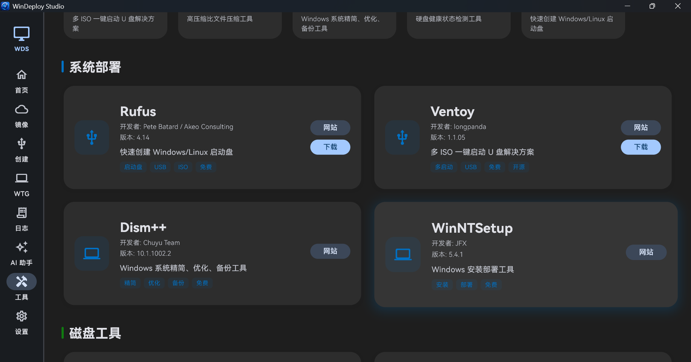<br><sub><b>8. Disk Test</b> - Run and review storage performance tests with saved test history.</sub></td>
    <td width="50%">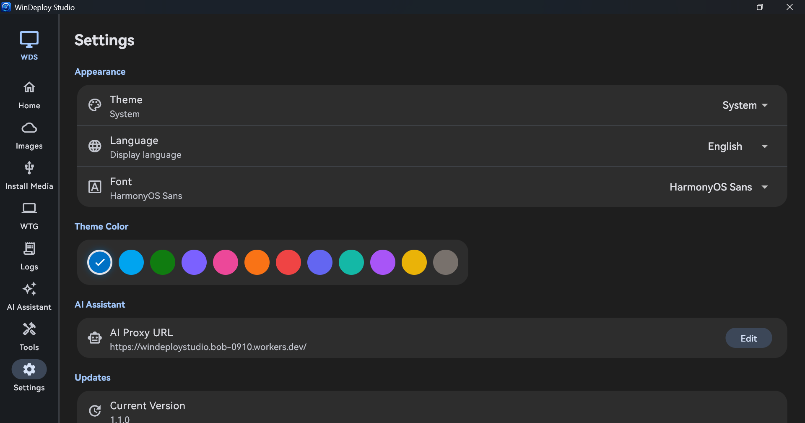<br><sub><b>9. Disk Tools</b> - Open the disk-utility directory and choose the appropriate storage workflow.</sub></td>
  </tr>
  <tr>
    <td width="50%">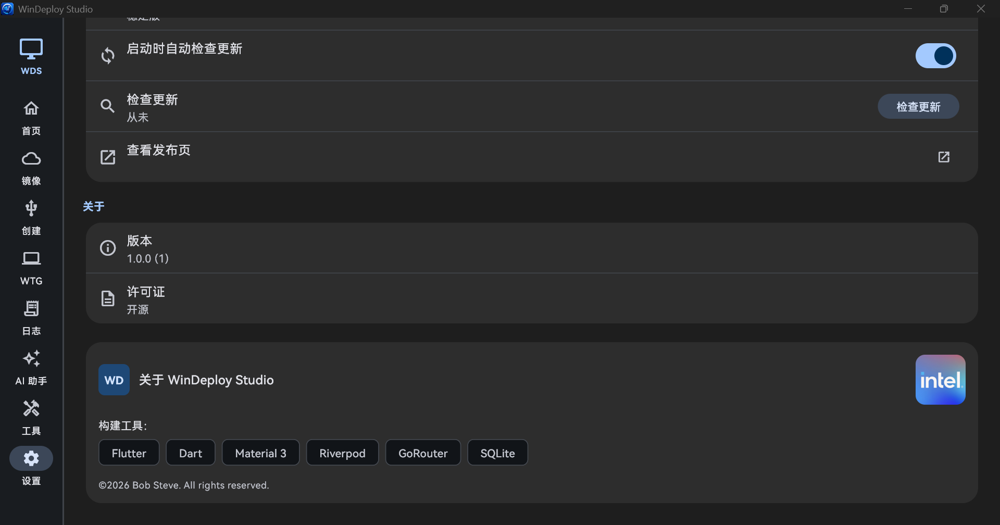<br><sub><b>10. Disk Diagnostics</b> - Review available drive identity, health, and diagnostic information.</sub></td>
    <td width="50%">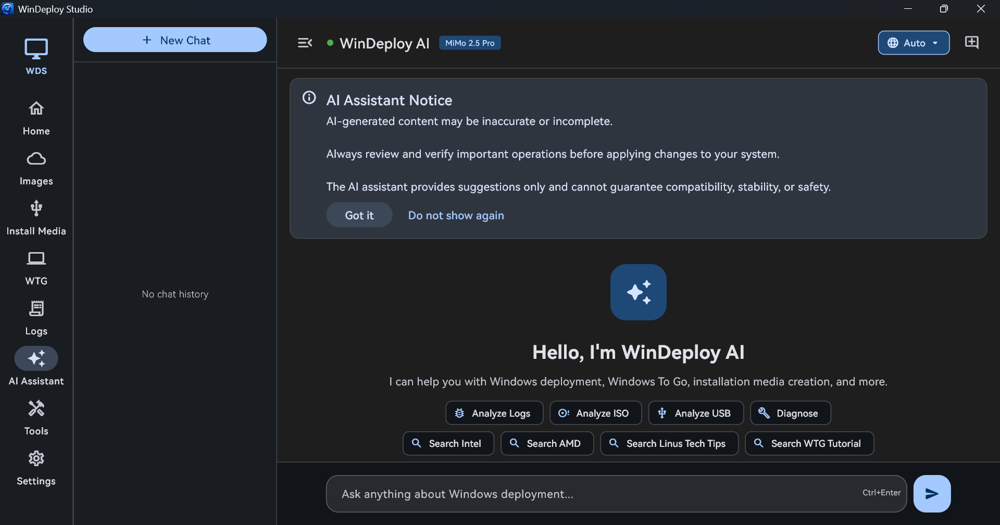<br><sub><b>11. BCD/EFI Boot Repair</b> - Inspect and repair supported Windows boot configuration and EFI boot entries.</sub></td>
  </tr>
</table>

### 6. Log Center

Log Center collects output from installation media, To Go, image downloads, updates, AI requests, diagnostics, and errors. It provides both an overview and a focused detail view for reviewing completed work.

<table>
  <tr>
    <td width="50%">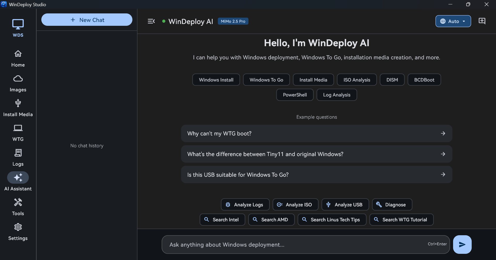<br><sub><b>12. Log Center</b> - Browse log categories, sources, recent activity, warnings, and results.</sub></td>
    <td width="50%">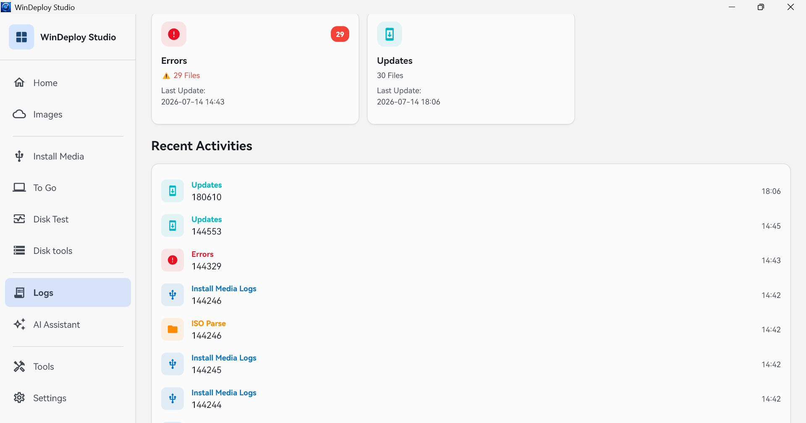<br><sub><b>13. Log Details</b> - Inspect a selected log entry and its structured operation output.</sub></td>
  </tr>
</table>

### 7. AI Assistant

The AI Assistant provides deployment guidance, troubleshooting suggestions, and log-analysis help. For USB analysis and To Go suitability questions, users can select multiple saved disk-test records; the sent plain-text context includes the device, test configuration, measurements, raw sample points, and metric definitions. If no record is available, the request recommends a Standard test. AI output remains advisory and should be verified before an important operation.

For an OpenAI-compatible provider, open Settings > AI Assistant and enter its HTTPS service endpoint, API Key, and model ID. The app uses standard `/chat/completions`, `/responses`, `/models`, Bearer authentication, and function-tool conventions where the provider supports them. API Keys are protected with Windows DPAPI and are never written to logs or shown in full. Web search is attempted through the provider's documented tool routes and a bounded public search fallback; the answer status identifies whether a live search was actually confirmed. When web search is enabled, only a bounded search query is sent to the public search backend; the AI API Key is never sent there. Do not use Force search for logs, serial numbers, file paths, or other private text.

<table>
  <tr>
    <td>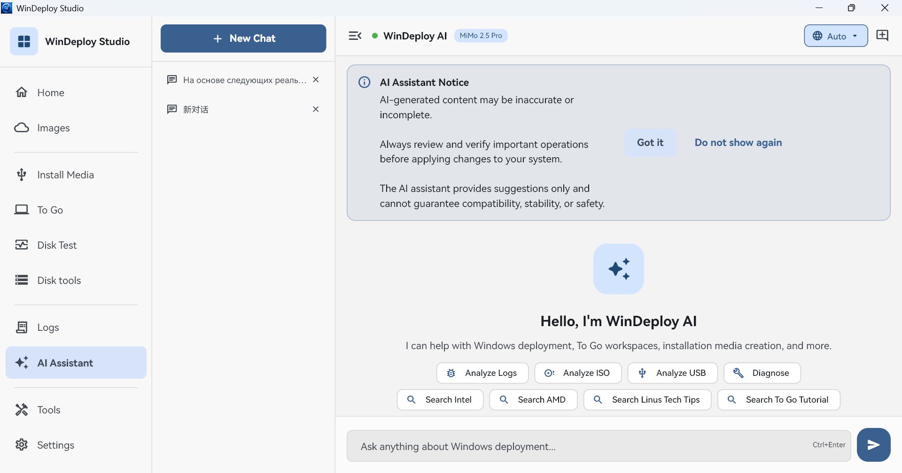<br><sub><b>14. AI Assistant</b> - Ask deployment questions, analyze selected disk-test records, and review the AI safety notice.</sub></td>
  </tr>
</table>

### 8. Tools

Tools groups useful Windows deployment, recovery, diagnostics, hardware, network, and optimization utilities. Tool cards include source information and clear safety levels for advanced or expert actions.

<table>
  <tr>
    <td>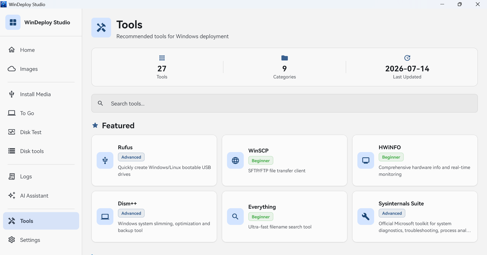<br><sub><b>15. Tools</b> - Browse curated utilities and their beginner, advanced, or expert suitability labels.</sub></td>
  </tr>
</table>

### 9. Settings

Settings centralizes application preferences, localization, local paths, update choices, version details, licensing, and acknowledgements. The three views below show the settings area as users move through it.

<table>
  <tr>
    <td width="33%">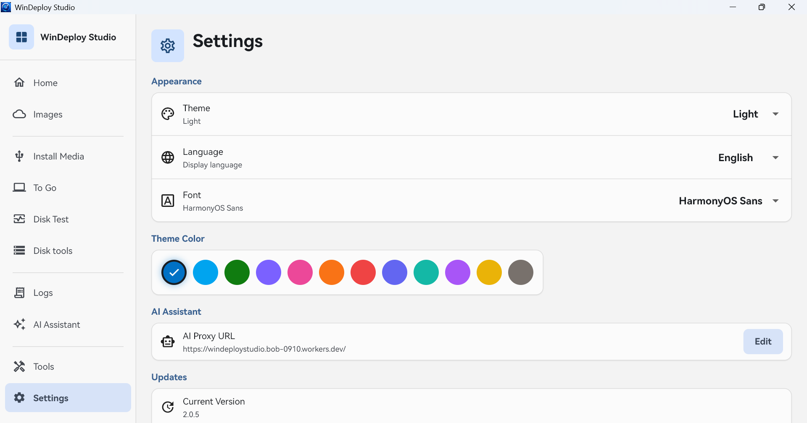<br><sub><b>16. Settings - 1</b> - First view of the central settings area.</sub></td>
    <td width="33%">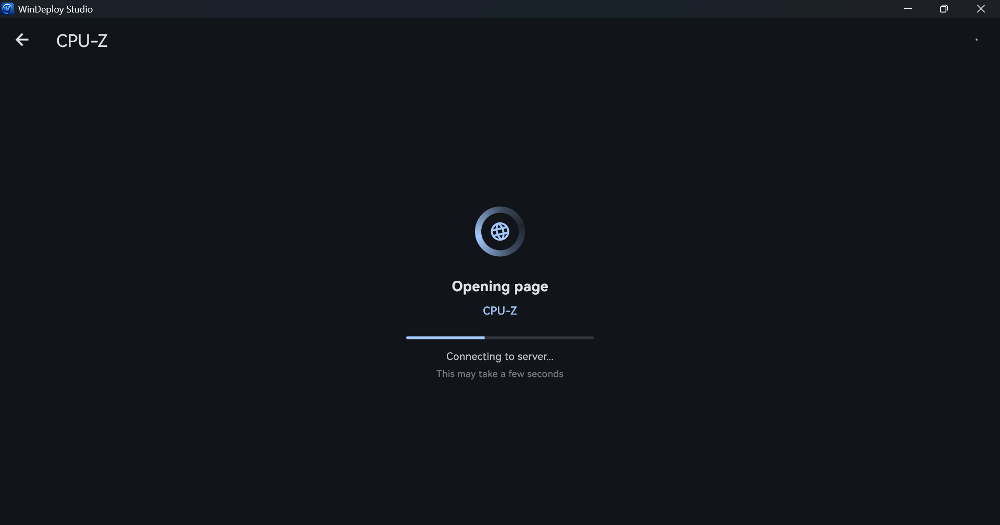<br><sub><b>17. Settings - 2</b> - Second view of the central settings area.</sub></td>
    <td width="33%">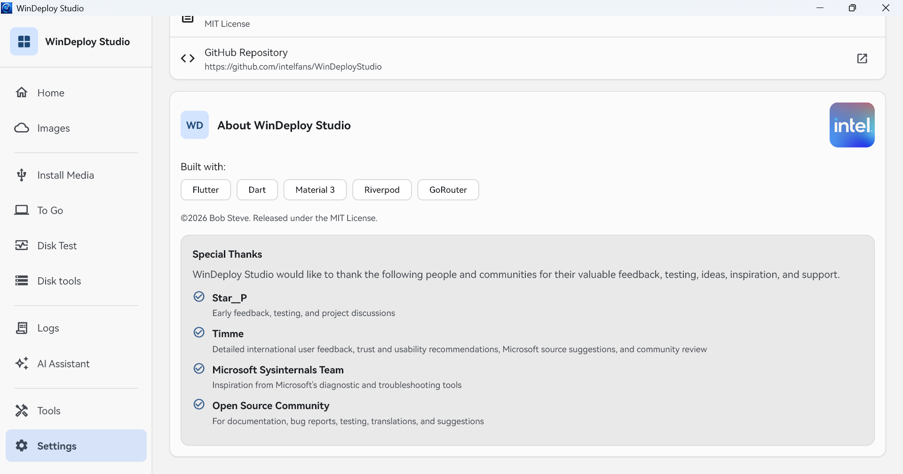<br><sub><b>18. Settings - 3</b> - Third view of the central settings area.</sub></td>
  </tr>
</table>

## System Requirements

| Item | Minimum | Recommended |
|:---|:---|:---|
| OS | Windows 10 1809 | Windows 11 |
| Architecture | x64 | x64 |
| RAM | 4 GB | 8 GB or more |
| Storage | 500 MB for app | Extra space for ISO files and deployment media |
| Runtime | WebView2 for built-in web pages | Latest WebView2 Runtime |

WinDeploy Studio requests administrator privileges when it starts. This lets
disk-changing and boot-configuration operations run in the same elevated
application process. If UAC approval is cancelled, the application does not
start.

## Download

Download releases from:

[https://github.com/intelfans/WinDeployStudio/releases](https://github.com/intelfans/WinDeployStudio/releases)

### Update and download integrity

The in-app updater reads the SHA-256 digest published for the matching GitHub
Release installer asset. It verifies the downloaded bytes against that digest
before an installer can run. When an update is downloaded through the project's
mirror channel, the same GitHub Release digest is still required, so choosing a
mirror does not weaken file-integrity verification. Downloads obtained outside
the app should still be checked against the release's published digest before
manual installation.

## Build From Source

Prerequisites:

- Flutter SDK with Windows desktop support enabled
- Visual Studio Build Tools with C++ desktop workload
- Inno Setup 6 or 7 for installer builds
- PowerShell 7 recommended

Commands:

```powershell
flutter pub get
flutter analyze --no-fatal-infos
flutter build windows --release
```

Build the installer:

```powershell
.\scripts\build_installer.ps1
```

The installer output is created under:

```text
dist\windows\
```

## Project Structure

```text
lib/
  app/                  App shell, routing, theme
  core/
    config/             AI and app configuration
    constants/          App constants
    localization/       11-language UI strings
    services/           Disk safety, ISO, To Go, update, and mirror services
    utils/              Shared helpers
  features/
    ai_assistant/       AI assistant UI and services
    benchmark/          Native drive benchmark and charts
    benchmark_history/  Saved results, comparison, and export
    creator/            Windows/Linux installation media creator
    deployment/         Deployment plans, compatibility, Windows policies
    disk_tools/         Read-only diagnostics and guarded boot repair
    home/               Quick Start and project information
    logs/               Log center
    mirror/             Image center
    settings/           App settings
    tools/              Toolbox
    update/             Update flow
    wtg/                Windows To Go creator
  shared/
    webview/            Built-in web view and download UI
    widgets/            Responsive deployment shell and shared controls
```

## Safety And Licensing

WinDeploy Studio does not provide Windows licenses, product keys, activation services, or authorization bypass mechanisms. Users are responsible for complying with all applicable software license agreements.

The Toolbox provides links to independent third-party projects. Their downloads, licenses, terms, and support are controlled by their respective publishers. Check the publisher's terms before use.

Windows, Microsoft, Sysinternals, and other product names, trademarks, logos, and external resources remain the property of their respective owners. WinDeploy Studio is not affiliated with Microsoft Corporation.

## Third-Party Notices

WinDeploy Studio is built with Flutter and the Dart packages declared in [pubspec.yaml](pubspec.yaml). Each package remains subject to its own license. The Toolbox links to external projects; it does not bundle their installers or provide support on behalf of their publishers.

Disk diagnostics use an independently implemented, read-only compatibility layer informed by the public protocol layouts and compatibility behavior of CrystalDiskInfo. WinDeploy Studio does not include or redistribute CrystalDiskInfo, its bridge DLLs, or its diagnostic executables.

## Special Thanks

WinDeploy Studio would like to thank the following people and communities for their valuable feedback, testing, ideas, inspiration, and support.

- **Star__P** - Early feedback, testing, and project discussions
- **Timme** - Detailed international user feedback, trust and usability recommendations, Microsoft source suggestions, and community review
- **Microsoft Sysinternals Team** - Inspiration from Microsoft's diagnostic and troubleshooting tools
- **Open Source Community** - Documentation, bug reports, testing, translations, and suggestions

## License

MIT License. See [LICENSE](LICENSE).

---

# WinDeploy Studio 中文说明

WinDeploy Studio 是一款运行于 Windows 的现代化部署工具，面向 Windows 安装盘、Linux ISOHybrid 写盘、Windows To Go、原生磁盘测试、镜像资源、工具箱、日志查看和 AI 辅助排障等场景。

## 核心功能

- **安装盘创建工具**
  - 从 ISO 创建 Windows 安装 U 盘，或写入可启动的 Linux ISOHybrid 镜像。
  - 此流程应使用普通安装镜像：Windows 镜像必须包含标准 Setup/WIM 结构，Linux 镜像应为发行版提供的普通可启动安装镜像；WinPE 或仅恢复用途的镜像不视为普通 Windows 安装镜像。
  - 自动解析 Windows ISO，列出可安装版本。
  - Windows 安装盘可选择 UEFI + GPT、UEFI + MBR 或 Legacy BIOS，并可指定分区盘符、自定义卷标和图标。
  - 在擦除目标磁盘前验证 Linux ISOHybrid 结构，并仅显示在所选镜像中检测到的 Legacy BIOS、UEFI 与标准 EFI 回退启动文件 CPU 架构。
  - Linux 安装盘为 ISOHybrid 原样逐字节写入：保留镜像自身的分区和启动布局，不会转换 UEFI/MBR/Legacy 启动模式，也不会创建持久化或剩余空间分区。Secure Boot 兼容性取决于镜像签名和目标固件，程序不会推断或保证其可用性。
  - 某些固件会因镜像同时提供多条启动路径，或重复枚举同一个设备，而把同一个 Linux USB 显示为两个名称相近的启动项；这不表示应用写入了两份镜像。该规则不限于某几个发行版：请选择能进入对应发行版正常安装菜单的项目；若某一项进入 `grub>`、黑屏或无法继续，请返回启动菜单尝试另一个同名项目。电脑使用 UEFI 模式时，优先选择明确带有 UEFI 标识的项目。
  - 每次破坏性操作都绑定到用户选择的外接磁盘，并在写入前再次核验。

- **To Go 工作环境创建工具**
  - 创建便携式 Windows To Go 工作空间。
  - 对标准且结构完整的 Windows 镜像，代码层面的识别和部署方式可用性如下：

    | 镜像系列 | 直接部署 | VHD | VHDX | 说明 |
    |:---|:---:|:---:|:---:|:---|
    | Windows 7 | 支持 | 仅 Enterprise/Ultimate | 不支持 | 仅尽力支持。启动模式以 ISO 实际文件为准；缺少可验证 x64 UEFI 回退文件的原版镜像会限制为 Legacy BIOS，通常还需要匹配的旧版驱动与补丁。 |
    | Windows 8 | 支持 | 支持 | 支持 | 仅尽力支持。正确识别后开放三种部署方式，但仍可能需要匹配的驱动与补丁。 |
    | Windows 8.1 | 支持 | 支持 | 支持 | 仅尽力支持。WIMBoot 仅限直接部署，仍可能需要匹配的驱动与补丁。 |
    | Windows 10/11 | 支持 | 支持 | 支持 | 当前经过验证的正常制作范围；CompactOS 仅适用于这些版本。 |
    | Windows Server | 支持 | 支持 | 仅 Server 2012 及更高版本 | 仅尽力支持。Server 2008 R2 支持 VHD 但不支持 VHDX；Server 2012 及更高版本支持两者，并排除仅适用于客户端的选项。 |

    该矩阵表示代码层面的镜像识别和部署方式可用性。当前经过验证、作为正常制作范围说明的是 Windows 10 和 Windows 11，并且仍要求使用结构完整的标准镜像与兼容硬件。Windows 7、Windows 8、Windows 8.1 和 Windows Server 可以被识别并尝试部署，但不保证能在每台电脑或每种启动模式下正常启动。旧系统通常需要与系统版本和目标硬件匹配的 USB、芯片组、存储与启动驱动，以及必要补丁或其他启动/修复工具。写入前应准备这些资源，完成后先在目标电脑测试，并将重要数据另行备份。
  - Windows To Go 接受包含 `boot.wim` 以及 `install.wim` 或 `install.esd` 的普通 Windows 安装 ISO；WIMBoot 还要求使用 `install.wim`。分卷 `install.swm` 镜像或缺少 BIOS/EFI 必需启动文件的镜像，会在修改目标磁盘前被拒绝。
  - Linux 便携工作环境计划在未来版本中提供，当前版本暂不可用；现阶段可使用 Linux 安装盘创建可启动安装介质。
  - 执行前经过镜像、磁盘、部署方式、高级选项和配置摘要五步流程。
  - 可选择 UEFI + GPT、UEFI + MBR 或 Legacy BIOS，并将 Windows 直接部署到分区或动态/固定 VHD、VHDX；不兼容的镜像与模式组合会在写盘前阻止。该选择只决定写盘布局，不保证目标固件一定可启动：现代 UEFI 固件使用 UEFI + GPT；只有固件明确支持从 MBR 启动时才选择 UEFI + MBR；传统 BIOS 设备才选择 Legacy BIOS。
  - 在支持的组合中配置本地磁盘可见性、简化首次设置、UASP、CompactOS、WIMBoot、VHD/VHDX 盘符修复、.NET Framework 3.5 和部署盘符。“简化首次设置”使用受支持的无人参与设置隐藏部分页面，不承诺跳过全部 OOBE 步骤，也不会切换到审核模式。为保证恢复和启动修复能力，Windows To Go 会保留 WinRE，当前不提供离线删除恢复环境的选项。
  - 禁用 UASP 仅是专家级排障选项，必须先确认 USB 桥接器能够回退到 BOT 模式；仅支持 UAS 的设备可能失去对自身启动盘的访问并无法启动。CompactOS 仅适用于 Windows 10/11 客户端镜像，以更长部署时间和部分读写开销换取更小占用。.NET Framework 3.5 只能使用所选 ISO 中 `sources\\sxs` 的离线源，且必须与目标镜像的版本、架构和语言相匹配。
  - 可选离线注入 Windows INF 驱动。
  - 为 Windows To Go 创建独立启动分区，并验证 BCD、虚拟磁盘绑定和 UEFI 回退启动文件。
  - 在清盘前重新核验磁盘号、容量、型号与总线类型，优先使用可靠硬件序列号；无法建立稳定物理身份时拒绝清盘。
  - 应用镜像阶段只显示可靠的已用时间。

- **反馈**
  - 设置中的“反馈”会直接打开项目的 [GitHub Issue 创建页面](https://github.com/intelfans/WinDeployStudio/issues/new)。
  - 安装盘或 To Go 确实以失败状态结束时，结果页面会显示“报告此次失败”；成功完成和用户主动取消不会触发该按钮。

- **原生磁盘测试**
  - 使用 Windows 原生无缓冲、写穿透 I/O，而不是容易受缓存影响的文件复制测速。
  - 测量顺序读写、4K 随机读写、真实多线程扩展、混合负载、延迟分位数，并可选测试全盘写入稳定性。
  - 提供快速、标准、极限、全盘写入四种模式，配合实时折线图、缓存行为分析和面向 To Go 的实用评级建议。
  - 成功结果会自动保存，可查看详情、按日期筛选、比较两次结果、删除并导出 CSV/JSON。
  - 在询问 AI 某个 USB 是否适合做随身系统，或使用“分析 USB”时，可选择一条或多条保存的记录；设备信息、测试参数、测量数据和指标含义会以纯文本一并发送。
  - 未选择已保存记录时，发给 AI 的请求会建议先完成一次标准磁盘测试，再对随身系统适用性作出有把握的判断。
  - 测试文件带独立所有权标记，仅清理由本次测试创建的数据。

- **磁盘工具**
  - 通过带超时边界的原生 helper 以只读方式收集磁盘身份、健康、可靠性、寿命、温度、磨损和 NVMe 遥测；慢速或不受支持的查询会明确显示为不可用或采集警告，不会阻塞整个扫描。
  - 从已提升权限的应用进程中运行带超时边界的原生 helper；设备无响应时会给出受限失败结果，不会让诊断界面一直卡住。
  - 仅对重新核验后的外接非系统磁盘修复 UEFI/BIOS 启动文件，执行前经过预检、输入确认和 BCD 备份；不格式化磁盘，并在完成后验证结果和保存技术日志。

- **镜像中心**
  - 区分 **Microsoft 官方镜像**、**社区版本** 与 **企业版 / LTSC 构建**。
  - Windows 10 / Windows 11 官方条目始终跳转 Microsoft 官方网站，并使用系统默认浏览器打开。
  - 社区镜像在可用时提供中国镜像和 Global Mirror 下载选择。
  - 企业版与 LTSC 镜像标记为专家级部署资源，并提供清晰的来源与语言提示。
  - StarValleyX 仅在简体中文和繁体中文界面中显示。
  - CJK 字体包同样只在简体中文和繁体中文界面显示，仅向 Tiny10、Tiny11 和 Windows X-Lite 提供，不向 StarValleyX 提示。

- **工具箱**
  - 收录部署、诊断、恢复、硬件、网络、优化等工具。
  - 工具分为入门、高级、专家级三个安全等级。
  - 高级、专家级和激活相关工具打开前显示专业提示。
  - 新增 Microsoft Sysinternals Suite。

- **AI 助手**
  - 用于 Windows 部署问答、日志分析和排障建议。
  - 对“这个 USB 适合制作随身系统吗？”和“分析 USB”支持多选已保存的磁盘测试记录，以纯文本发送设备数据、运行参数、工作负载、采样点和指标解释。
  - 使用前显示 AI 内容提示。
  - 内置服务和所有自定义端点均执行同一套本地输出安全策略。服务端正文与来源标题会先完整缓存在本机，只有通过客户端筛查后才会显示；政治、色情、暴力、仇恨、极端主义、非法毒品、赌博及明确犯罪内容不会以流式片段进入对话。
  - 支持用户自行配置的任意兼容 OpenAI 的 HTTPS AI 服务端点。
  - 支持填写 API Key，并使用 Windows 用户级加密保护；模型可手动输入，也可从服务端点的 `/models` 列表选择。
  - 凭据只发送到用户明确配置的端点，内置服务不会接收用户 API Key；更改或恢复默认端点会清除已保存的密钥。

- **日志中心**
  - 汇总安装盘、随身系统、镜像、下载、更新、AI 和错误日志。
  - 支持分类查看和快速打开日志目录。

- **界面与导航**
  - 在受支持的 Windows 10/11 主机上统一使用 Windows 11 风格界面。
  - 左侧主导航用清晰的分隔线分组；从磁盘工具或测试历史等二级页面选择主导航时，会直接打开所选目标页，不再保留之前的二级页面。

- **多语言**
  - 支持 11 种界面语言：简体中文、繁体中文、英语、日语、韩语、德语、法语、西班牙语、葡萄牙语、俄语、阿拉伯语。

## 界面截图

以下 18 张截图按左侧导航和主工作区的使用顺序排列：从首页出发，依次展示镜像与部署流程、磁盘工具、日志、AI、工具箱和设置页。

### 1. 首页

首页是 WinDeploy Studio 的起点，将产品标题、快速开始入口、工作区内容和项目信息放在同一处，不需要再经过单独的介绍页。

<table>
  <tr>
    <td width="50%"><br><sub><b>1. 首页</b> - 展示产品标题、快速开始入口和工作区概览。</sub></td>
    <td width="50%"><br><sub><b>2. 关于</b> - 展示版本、平台、许可证、GitHub 仓库和项目鸣谢等信息。</sub></td>
  </tr>
</table>

### 2. 镜像库

镜像库将官方镜像、社区版本、企业版与 LTSC 构建和辅助资源清晰分开。用户在打开下载链接前，可以先确认来源、用途、语言支持和适用级别。

<table>
  <tr>
    <td><br><sub><b>3. 镜像库</b> - 按类别浏览镜像资源，并在下载前确认来源和适用性。</sub></td>
  </tr>
</table>

### 3. 安装盘制作

Windows 与 Linux 安装盘是两个独立流程。两者都会在写入前明确显示所选 ISO、目标磁盘、验证结果以及将要执行的破坏性操作。

<table>
  <tr>
    <td width="50%"><br><sub><b>4. Windows 安装盘</b> - 选择并验证 Windows ISO，选择版本与目标磁盘，然后创建可启动安装介质。</sub></td>
    <td width="50%"><br><sub><b>5. Linux 安装盘</b> - 验证 Linux ISOHybrid 镜像，核对目标磁盘，并写入可启动 Linux 安装盘。</sub></td>
  </tr>
</table>

### 4. Windows To Go 工作环境

To Go 区域用于创建便携的 Windows 工作环境。在任何破坏性操作开始前，它会将所选镜像、目标磁盘、兼容性检查、可选项和确认摘要集中展示。Linux 便携工作环境计划在未来版本中提供。

<table>
  <tr>
    <td><br><sub><b>6. Windows To Go</b> - 在一个流程中设置便携 Windows 工作区的镜像、磁盘和部署选项。</sub></td>
  </tr>
</table>

### 5. 磁盘工具

磁盘功能分为磁盘测试、磁盘工具主目录、磁盘诊断和 BCD/EFI 启动修复，帮助用户在打开功能前先判断操作范围与风险。

<table>
  <tr>
    <td width="50%"><br><sub><b>8. 磁盘测试</b> - 运行并查看存储性能测试，测试记录可保存到历史中。</sub></td>
    <td width="50%"><br><sub><b>9. 磁盘工具</b> - 打开磁盘工具主目录，选择对应的存储操作流程。</sub></td>
  </tr>
  <tr>
    <td width="50%"><br><sub><b>10. 磁盘诊断</b> - 查看可用的硬盘身份、健康状态和诊断信息。</sub></td>
    <td width="50%"><br><sub><b>11. BCD/EFI 启动修复</b> - 检查并修复受支持的 Windows 启动配置与 EFI 启动项。</sub></td>
  </tr>
</table>

### 6. 日志中心

日志中心汇总安装盘制作、随身系统、镜像下载、更新检查、AI 请求、诊断和错误信息等输出，同时提供概览和详情两种查看方式，方便回顾已完成的工作。

<table>
  <tr>
    <td width="50%"><br><sub><b>12. 日志中心</b> - 按类别、来源、最近活动、警告和结果浏览日志。</sub></td>
    <td width="50%"><br><sub><b>13. 日志详情</b> - 查看选中日志及其结构化操作输出。</sub></td>
  </tr>
</table>

### 7. AI 助手

AI 助手用于部署问答、排障建议和日志分析。对 USB 分析和随身系统适用性问题，用户可多选已保存的磁盘测试记录；发送的纯文本上下文包括设备信息、测试配置、测量结果、原始采样点和指标解释。没有可用记录时，请求会建议先运行一次标准测试。AI 输出仅供辅助，重要操作前仍应自行核实。

对于兼容 OpenAI 的服务，请在“设置 > AI 助手”中填写服务商提供的 HTTPS 服务端点、API Key 和模型 ID。应用使用标准的 `/chat/completions`、`/responses`、`/models`、Bearer 认证和 function tool 约定（具体取决于服务商支持情况）。API Key 使用 Windows DPAPI 保护，不会写入日志或完整显示。联网搜索会优先尝试服务端公开的工具路由，并在需要时使用受限的公共搜索回退；回答下方的状态会明确说明是否实际确认了联网搜索。开启联网搜索后，只有受长度限制的搜索词会发送给公共搜索后端；AI API Key 绝不会发送到该后端。请勿对日志、序列号、文件路径或其他私密文本使用“强制”搜索。

<table>
  <tr>
    <td><br><sub><b>14. AI 助手</b> - 提出部署问题，分析所选磁盘测试记录，并查看 AI 使用提示。</sub></td>
  </tr>
</table>

### 8. 工具箱

工具箱收录部署、恢复、诊断、硬件、网络和优化等常用工具。工具卡片会展示来源信息和明确的入门、高级或专家级适用标签。

<table>
  <tr>
    <td><br><sub><b>15. 工具箱</b> - 浏览精选工具及其入门、高级或专家级适用标签。</sub></td>
  </tr>
</table>

### 9. 设置

设置页集中管理应用偏好、本地化、路径、更新选择、版本信息、许可证和鸣谢内容。以下三张图展示用户在设置区域中的不同视图。

<table>
  <tr>
    <td width="33%"><br><sub><b>16. 设置 - 1</b> - 设置区域的第一个视图。</sub></td>
    <td width="33%"><br><sub><b>17. 设置 - 2</b> - 设置区域的第二个视图。</sub></td>
    <td width="33%"><br><sub><b>18. 设置 - 3</b> - 设置区域的第三个视图。</sub></td>
  </tr>
</table>

## 系统要求

| 项目 | 最低要求 | 建议配置 |
|:---|:---|:---|
| 操作系统 | Windows 10 1809 | Windows 11 |
| 架构 | x64 | x64 |
| 内存 | 4 GB | 8 GB 或更高 |
| 存储空间 | 应用本体约 500 MB | 为 ISO 文件和部署介质预留额外空间 |
| 运行时 | 内置网页需要 WebView2 | 最新版 WebView2 Runtime |

WinDeploy Studio 会在启动时请求管理员权限。这样清盘、分区、写入镜像和启动
修复等会修改磁盘或启动配置的操作可在同一个已提升权限的应用进程中执行。若
取消 UAC 授权，应用不会启动。

## 下载

请从 GitHub Releases 下载：

[https://github.com/intelfans/WinDeployStudio/releases](https://github.com/intelfans/WinDeployStudio/releases)

### 更新与下载完整性

应用内更新会读取对应 GitHub Release 安装包资产发布的 SHA-256 摘要，并在启动
安装包前校验下载文件是否一致。通过项目镜像渠道下载更新时，仍必须匹配同一份
GitHub Release 摘要，因此选择镜像不会降低完整性校验要求。若在应用外手动下载，
安装前仍应将文件与 Release 公布的摘要进行比对。

## 从源码构建

前置要求：

- 已启用 Windows 桌面支持的 Flutter SDK
- 安装带 C++ 桌面开发工作负载的 Visual Studio Build Tools
- 构建安装包需要 Inno Setup 6 或 7
- 建议使用 PowerShell 7

```powershell
flutter pub get
flutter analyze --no-fatal-infos
flutter build windows --release
```

构建安装包：

```powershell
.\scripts\build_installer.ps1
```

安装包输出目录：

```text
dist\windows\
```

## 项目结构

```text
lib/
  app/                  应用外壳、路由和主题
  core/
    config/             AI 与应用配置
    constants/          应用常量
    localization/       11 种界面语言
    services/           磁盘安全、ISO、随身系统、更新和镜像服务
    utils/              通用工具函数
  features/
    ai_assistant/       AI 助手界面与服务
    benchmark/          原生磁盘测试与折线图
    benchmark_history/  测试历史、比较与导出
    creator/            Windows / Linux 安装盘创建工具
    deployment/         部署计划、兼容性和 Windows 策略
    disk_tools/         只读诊断和受保护的启动修复
    home/               快速开始与项目信息
    logs/               日志中心
    mirror/             镜像中心
    settings/           应用设置
    tools/              工具箱
    update/             更新流程
    wtg/                Windows To Go 创建工具
  shared/
    webview/            内置网页和下载界面
    widgets/            响应式部署外壳和共享控件
```

## 安全与许可声明

WinDeploy Studio 基于 MIT License 分发。

本项目不提供 Windows 授权、产品密钥、激活服务或绕过授权机制。用户需自行确保遵守 Microsoft 及其他软件厂商的许可协议。

工具箱提供独立第三方项目的链接；其下载、许可证、使用条款和支持均由各自发布者负责。使用前请确认发布者的条款。

第三方软件、商标、Logo 和外部资源归其各自所有者所有。WinDeploy Studio 与 Microsoft Corporation 无官方隶属关系。

## 第三方工具说明

WinDeploy Studio 使用 Flutter 及 [pubspec.yaml](pubspec.yaml) 中声明的 Dart 软件包构建；各软件包仍受其各自许可证约束。工具箱仅提供外部项目链接，不捆绑其安装包，也不代表其发布者提供支持。

磁盘诊断使用独立实现的只读兼容层，并参考 CrystalDiskInfo 的公开协议布局与兼容性行为。WinDeploy Studio 不包含或再分发 CrystalDiskInfo、其桥接 DLL 或诊断可执行文件。

## 特别鸣谢

WinDeploy Studio 感谢以下个人和社区提供的反馈、测试、想法、灵感与支持。

- **Star__P** - 早期反馈、测试和项目讨论
- **Timme** - 细致的国际用户反馈、信任与易用性建议、Microsoft 官方来源建议和社区审阅
- **Microsoft Sysinternals Team** - 来自 Microsoft 诊断与故障排查工具的启发
- **Open Source Community** - 文档、错误报告、测试、翻译和建议

## 许可证

MIT License，详见 [LICENSE](LICENSE)。
