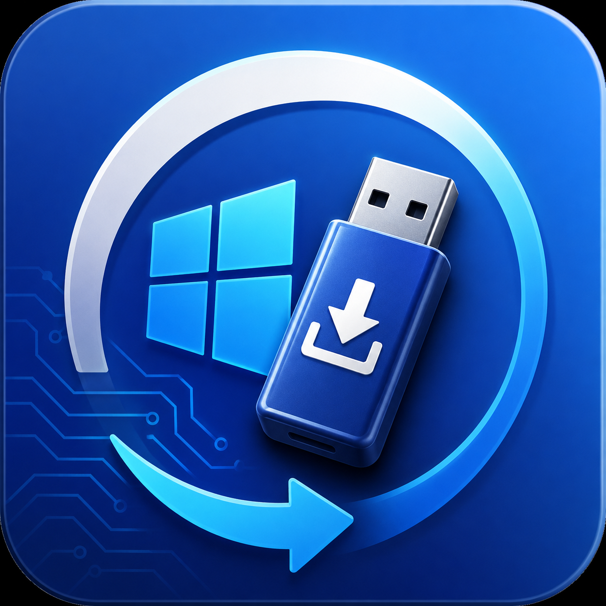

# WinDeploy Studio

<p align="center">
  
</p>

<p align="center">
  <strong>Modern Windows Deployment Toolkit</strong>
</p>

<p align="center">
  
  
  
  
</p>

---

<p align="center">
  <a href="#english">English</a> ·
  <a href="#简体中�?>简体中�?/a> ·
  <a href="#繁體中文">繁體中文</a> ·
  <a href="#日本�?>日本�?/a> ·
  <a href="#한국�?>한국�?/a> ·
  <a href="#deutsch">Deutsch</a> ·
  <a href="#français">Français</a> ·
  <a href="#español">Español</a> ·
  <a href="#português">Português</a> ·
  <a href="#русский">Русский</a> ·
  <a href="#العربية">العربية</a>
</p>

---

## English

WinDeploy Studio is a modern Windows deployment toolkit built with Flutter. It integrates Windows installation media creation, Windows To Go, image center, toolbox, log center, and AI assistant into a unified interface.

### Screenshots

| Home | Image Center | Bootable Media |
|:---:|:---:|:---:|
|  |  |  |

| Windows To Go | Logs | AI Assistant |
|:---:|:---:|:---:|
|  |  |  |

| Toolbox | Settings | Settings |
|:---:|:---:|:---:|
|  |  |  |

### Features

| Feature | WinDeploy Studio |
|:---|:---:|
| Windows To Go | �?|
| Bootable Media | �?|
| Image Center | �?|
| Toolbox | �?|
| AI Assistant | �?|
| Log Center | �?|
| Multi-language | �?|
| Auto Update | �?|

### Key Features

#### 💿 Bootable Media Creation
- Windows 10 / Windows 11 support
- ISO auto-parsing (install.wim / install.esd)
- Multi-version image selection
- Auto format and bootable creation

#### 🚀 Windows To Go
- One-click creation
- Auto disk compatibility detection
- Capacity / Bus type / USB version analysis
- GPT / UEFI support

#### 📦 Image Center
- Built-in Windows image navigation
- Auto region-based mirror switching
- In-app browsing and download

#### 🧰 Toolbox
System deployment, disk utilities, hardware detection, network tools, system optimization, system rescue, file tools.

#### 🤖 AI Assistant
- Based on Mimo-V2.5-Pro
- Chat, web search, log analysis, fault diagnosis

#### 📋 Log Center
- USB / ISO / Download / Update / Error / AI logs
- Category view, quick locate, one-click open

#### 🌍 Multi-language
11 languages: Simplified Chinese, Traditional Chinese, English, Japanese, Korean, German, French, Spanish, Portuguese, Russian, Arabic.

#### 🎨 Personalization
Dark mode, Intel Blue theme, custom colors, HarmonyOS Sans, Microsoft YaHei.

### Architecture

```
lib/
├── app/                  # App entry, routing, theme
├── core/
�?  ├── config/           # AI config
�?  ├── constants/        # App constants
�?  ├── database/         # SQLite
�?  ├── localization/     # 11 languages
�?  ├── services/         # Core services
�?  └── utils/            # Utilities
├── features/
�?  ├── ai_assistant/     # AI chat
�?  ├── creator/          # Bootable media
�?  ├── home/             # Home dashboard
�?  ├── logs/             # Log center
�?  ├── mirror/           # Image center
�?  ├── settings/         # Settings
�?  ├── tools/            # Toolbox
�?  ├── update/           # Auto update
�?  └── wtg/              # Windows To Go
└── shared/
    ├── webview/          # In-app browser
    └── adblock/          # Ad blocking
```

### System Requirements

| | Minimum | Recommended |
|:---|:---|:---|
| OS | Windows 10 1809 | Windows 11 |
| RAM | 4 GB | 8 GB |
| Storage | 500 MB | 1 GB |
| Runtime | �?| WebView2 |

### Download

[GitHub Releases](https://github.com/intelfans/WinDeployStudio/releases)

### Tech Stack

Flutter · Dart · Riverpod · SQLite · WebView2 · Cloudflare Worker · Mimo API

### Changelog

#### v1.0.2
- WTG progress UI: real-time elapsed time, write speed, written/total size, remaining size
- Update dialog: Markdown rendering for release notes
- Update dialog: browser download button
- Version bump to 1.0.2

#### v1.0.1
- Manual mirror selection system (China/Global)
- Download experience optimization
- Auto update system improvements
- UI/UX enhancements

#### v1.0.0
- Initial release
- Windows installation media creation
- Windows To Go
- Image center with mirror switching
- Toolbox with 30+ tools
- AI assistant (Mimo-V2.5-Pro)
- Log center
- 11 language support
- Auto update system

### License

MIT License

### Disclaimer

This project is for legitimate system deployment, learning, and maintenance purposes only. Windows, Microsoft, Intel, and their related names, trademarks, and logos belong to their respective owners. This project has no official affiliation with Microsoft Corporation or Intel Corporation.

---

## 简体中�?
WinDeploy Studio 是一个基�?Flutter 开发的现代�?Windows 部署工具。它�?Windows 安装盘制作、Windows To Go、镜像中心、工具箱、日志中心以�?AI 助手整合到统一界面中�?
### 截图

| 首页 | 镜像中心 | 启动盘制�?|
|:---:|:---:|:---:|
|  |  |  |

| Windows To Go | 日志中心 | AI 助手 |
|:---:|:---:|:---:|
|  |  |  |

| 工具�?| 设置 | 设置 |
|:---:|:---:|:---:|
|  |  |  |

### 功能对比

| 功能 | WinDeploy Studio |
|:---|:---:|
| Windows To Go | �?|
| 安装盘制�?| �?|
| 镜像中心 | �?|
| 工具�?| �?|
| AI 助手 | �?|
| 日志中心 | �?|
| 多语言 | �?|
| 自动更新 | �?|

### 核心功能

#### 💿 启动盘制�?- 支持 Windows 10 / Windows 11
- ISO 自动解析（install.wim / install.esd�?- 多版本镜像选择
- 自动格式化并创建启动�?
#### 🚀 Windows To Go
- 一键制�?- 自动检测磁盘兼容�?- 容量 / 总线类型 / USB 版本分析
- 支持 GPT / UEFI

#### 📦 镜像中心
- 内置常用 Windows 镜像资源
- 自动区域镜像源切�?- 应用内浏览与下载

#### 🧰 工具�?系统部署、磁盘工具、硬件检测、网络工具、系统优化、系统救援、文件工具�?
#### 🤖 AI 助手
- 基于 Mimo-V2.5-Pro
- AI 对话、联网搜索、日志分析、故障诊�?
#### 📋 日志中心
- USB / ISO / 下载 / 更新 / 错误 / AI 日志
- 分类查看、快速定位、一键打开目录

#### 🌍 多语言
支持 11 种语言：简体中文、繁體中文、English、日本語、한국어、Deutsch、Français、Español、Português、Русский、العربية�?
#### 🎨 个性化
深色模式、Intel Blue 主题、自定义主题颜色、HarmonyOS Sans、微软雅黑�?
### 项目架构

```
lib/
├── app/                  # 应用入口、路由、主�?├── core/
�?  ├── config/           # AI 配置
�?  ├── constants/        # 常量
�?  ├── database/         # SQLite
�?  ├── localization/     # 11 种语言
�?  ├── services/         # 核心服务
�?  └── utils/            # 工具函数
├── features/
�?  ├── ai_assistant/     # AI 助手
�?  ├── creator/          # 启动盘制�?�?  ├── home/             # 首页
�?  ├── logs/             # 日志中心
�?  ├── mirror/           # 镜像中心
�?  ├── settings/         # 设置
�?  ├── tools/            # 工具�?�?  ├── update/           # 自动更新
�?  └── wtg/              # Windows To Go
└── shared/
    ├── webview/          # 内嵌浏览�?    └── adblock/          # 广告拦截
```

### 系统要求

| | 最低要�?| 推荐配置 |
|:---|:---|:---|
| 系统 | Windows 10 1809 | Windows 11 |
| 内存 | 4 GB | 8 GB |
| 存储 | 500 MB | 1 GB |
| 运行�?| �?| WebView2 |

### 下载

[GitHub Releases](https://github.com/intelfans/WinDeployStudio/releases)

### 技术栈

Flutter · Dart · Riverpod · SQLite · WebView2 · Cloudflare Worker · Mimo API

### 更新记录

#### v1.0.2
- WTG 进度 UI：实时显示已用时间、写入速度、已写入/总大小、剩余大小
- 更新弹窗：更新内容支持 Markdown 渲染
- 更新弹窗：新增浏览器下载按钮
- 版本号更新至 1.0.2

#### v1.0.1
- 手动镜像选择系统（国内/国际）
- 下载体验优化
- 自动更新系统改进
- UI/UX 增强

#### v1.0.0
- 首次发布
- Windows 安装盘制作
- Windows To Go
- 镜像中心与镜像源切换
- 工具箱集成 30+ 工具
- AI 助手（Mimo-V2.5-Pro）
- 日志中心
- 11 种语言支持
- 自动更新系统

### 开源协�?
MIT License

### 免责声明

本项目仅用于合法的系统部署、学习与维护用途。Windows、Microsoft、Intel 及其相关名称、商标、Logo 均归其各自权利人所有。本项目�?Microsoft Corporation、Intel Corporation 不存在任何官方关联关系�?
---

## 繁體中文

WinDeploy Studio 是一個基�?Flutter 開發的現代化 Windows 部署工具。它�?Windows 安裝盤製作、Windows To Go、鏡像中心、工具箱、日誌中心以�?AI 助手整合到統一介面中�?
### 截圖

| 首頁 | 鏡像中心 | 啟動盤製�?|
|:---:|:---:|:---:|
|  |  |  |

| Windows To Go | 日誌中心 | AI 助手 |
|:---:|:---:|:---:|
|  |  |  |

| 工具�?| 設定 | 設定 |
|:---:|:---:|:---:|
|  |  |  |

### 功能對比

| 功能 | WinDeploy Studio |
|:---|:---:|
| Windows To Go | �?|
| 安裝盤製�?| �?|
| 鏡像中心 | �?|
| 工具�?| �?|
| AI 助手 | �?|
| 日誌中心 | �?|
| 多語言 | �?|
| 自動更新 | �?|

### 核心功能

#### 💿 啟動盤製�?- 支援 Windows 10 / Windows 11
- ISO 自動解析（install.wim / install.esd�?- 多版本鏡像選�?- 自動格式化並建立啟動�?
#### 🚀 Windows To Go
- 一鍵製�?- 自動偵測磁碟相容�?- 容量 / 匯流排類�?/ USB 版本分析
- 支援 GPT / UEFI

#### 📦 鏡像中心
- 內建常用 Windows 鏡像資源
- 自動區域鏡像源切換
- 應用內瀏覽與下�?
#### 🧰 工具�?系統部署、磁碟工具、硬體偵測、網路工具、系統最佳化、系統救援、檔案工具�?
#### 🤖 AI 助手
- 基於 Mimo-V2.5-Pro
- AI 對話、聯網搜尋、日誌分析、故障診�?
#### 📋 日誌中心
- USB / ISO / 下載 / 更新 / 錯誤 / AI 日誌
- 分類檢視、快速定位、一鍵開啟目�?
#### 🌍 多語言
支援 11 種語言：簡體中文、繁體中文、English、日本語、한국어、Deutsch、Français、Español、Português、Русский、العربية�?
#### 🎨 個人�?深色模式、Intel Blue 主題、自訂主題顏色、HarmonyOS Sans、微軟雅黑�?
### 專案架構

```
lib/
├── app/                  # 應用程式進入點、路由、主�?├── core/
�?  ├── config/           # AI 組態
�?  ├── constants/        # 常數
�?  ├── database/         # SQLite
�?  ├── localization/     # 11 種語言
�?  ├── services/         # 核心服務
�?  └── utils/            # 工具函式
├── features/
�?  ├── ai_assistant/     # AI 助手
�?  ├── creator/          # 啟動盤製�?�?  ├── home/             # 首頁
�?  ├── logs/             # 日誌中心
�?  ├── mirror/           # 鏡像中心
�?  ├── settings/         # 設定
�?  ├── tools/            # 工具�?�?  ├── update/           # 自動更新
�?  └── wtg/              # Windows To Go
└── shared/
    ├── webview/          # 內建瀏覽�?    └── adblock/          # 廣告攔截
```

### 系統需�?
| | 最低需�?| 建議組態 |
|:---|:---|:---|
| 系統 | Windows 10 1809 | Windows 11 |
| 記憶�?| 4 GB | 8 GB |
| 儲存空間 | 500 MB | 1 GB |
| 執行階段 | �?| WebView2 |

### 下載

[GitHub Releases](https://github.com/intelfans/WinDeployStudio/releases)

### 技術堆�?
Flutter · Dart · Riverpod · SQLite · WebView2 · Cloudflare Worker · Mimo API

### 更新紀錄
#### v1.0.2
- WTG 進度 UI：即時顯示已用時間、寫入速度、已寫入/總大小、剩餘大小
- 更新視窗：更新內容支援 Markdown 渲染
- 更新視窗：新增瀏覽器下載按鈕
- 版本號更新至 1.0.2

#### v1.0.1
- 手動鏡像選擇系統（國內/國際）
- 下載體驗最佳化
- 自動更新系統改進
- UI/UX 增強

#### v1.0.0
- 首次發布
- Windows 安裝盤製作
- Windows To Go
- 鏡像中心與鏡像源切換
- 工具箱整合 30+ 工具
- AI 助手（Mimo-V2.5-Pro）
- 日誌中心
- 11 種語言支援
- 自動更新系統
- 工具箱整�?30+ 工具
- AI 助手（Mimo-V2.5-Pro�?- 日誌中心
- 11 種語言支援
- 自動更新系統

### 開源授權

MIT License

### 免責聲明

本專案僅用於合法的系統部署、學習與維護用途。Windows、Microsoft、Intel 及其相關名稱、商標、Logo 均歸其各自權利人所有。本專案�?Microsoft Corporation、Intel Corporation 不存在任何官方關聯關係�?
---

## 日本�?
WinDeploy Studio �?Flutter で開発されたモダンな Windows デプロイメントツールです。Windows インストールメディア作成、Windows To Go、イメージセンター、ツールボックス、ログセンター、AI アシスタントを統合インターフェースにまとめています�?
### スクリーンショッ�?
| ホー�?| イメージセンター | インストールメディア |
|:---:|:---:|:---:|
|  |  |  |

| Windows To Go | ログセンター | AI アシスタント |
|:---:|:---:|:---:|
|  |  |  |

| ツールボック�?| 設定 | 設定 |
|:---:|:---:|:---:|
|  |  |  |

### 機能比較

| 機能 | WinDeploy Studio |
|:---|:---:|
| Windows To Go | �?|
| インストールメディア作成 | �?|
| イメージセンター | �?|
| ツールボック�?| �?|
| AI アシスタント | �?|
| ログセンター | �?|
| 多言�?| �?|
| 自動更新 | �?|

### 主な機能

#### 💿 インストールメディア作成
- Windows 10 / Windows 11 対応
- ISO 自動解析（install.wim / install.esd�?- マルチバージョンイメージ選択
- 自動フォーマットとブータブル作成

#### 🚀 Windows To Go
- ワンクリック作成
- ディスク互換性自動検�?- 容量 / バスタイ�?/ USB バージョン解�?- GPT / UEFI 対応

#### 📦 イメージセンター
- Windows イメージナビゲーション内�?- 自動地域ミラー切�?- アプリ内ブラウジングとダウンロー�?
#### 🧰 ツールボック�?システムデプロイメント、ディスクユーティリティ、ハードウェア検出、ネットワークツール、システム最適化、システムレスキュー、ファイルツール�?
#### 🤖 AI アシスタント
- Mimo-V2.5-Pro ベー�?- チャット、Web 検索、ログ分析、故障診�?
#### 📋 ログセンター
- USB / ISO / ダウンロー�?/ アップデート / エラ�?/ AI ログ
- カテゴリ表示、クイックロケート、ワンクリックフォルダ開封

#### 🌍 多言�?11 言語対応：簡体中国語、繁体中国語、英語、日本語、韓国語、ドイツ語、フランス語、スペイン語、ポルトガル語、ロシア語、アラビア語�?
#### 🎨 パーソナライゼーショ�?ダークモード、Intel Blue テーマ、カスタムカラー、HarmonyOS Sans、Microsoft YaHei�?
### アーキテクチ�?
```
lib/
├── app/                  # エントリポイント、ルーティング、テーマ
├── core/
�?  ├── config/           # AI 設定
�?  ├── constants/        # 定数
�?  ├── database/         # SQLite
�?  ├── localization/     # 11 言�?�?  ├── services/         # コアサービス
�?  └── utils/            # ユーティリテ�?├── features/
�?  ├── ai_assistant/     # AI アシスタント
�?  ├── creator/          # メディア作成
�?  ├── home/             # ホー�?�?  ├── logs/             # ログセンター
�?  ├── mirror/           # イメージセンター
�?  ├── settings/         # 設定
�?  ├── tools/            # ツールボック�?�?  ├── update/           # 自動更新
�?  └── wtg/              # Windows To Go
└── shared/
    ├── webview/          # ビルトインブラウ�?    └── adblock/          # 広告ブロック
```

### システム要件

| | 最小要�?| 推奨構成 |
|:---|:---|:---|
| OS | Windows 10 1809 | Windows 11 |
| RAM | 4 GB | 8 GB |
| ストレー�?| 500 MB | 1 GB |
| ランタイ�?| �?| WebView2 |

### ダウンロー�?
[GitHub Releases](https://github.com/intelfans/WinDeployStudio/releases)

### 技術スタッ�?
Flutter · Dart · Riverpod · SQLite · WebView2 · Cloudflare Worker · Mimo API

### 変更履歴

#### v1.0.2
- WTG 進捗 UI：経過時間、書き込み速度、書き込み済み/合計サイズ、残り容量をリアルタイム表示
- 更新ダイアログ：リリースノートの Markdown レンダリング対応
- 更新ダイアログ：ブラウザダウンロードボタン追加
- バージョン 1.0.2 に更新

#### v1.0.1
- 手動ミラー選択システム（中国/グローバル）
- ダウンロード体験の最適化
- 自動更新システムの改善
- UI/UX の向上

#### v1.0.0
- 初回リリース
- Windows インストールメディア作成
- Windows To Go
- イメージセンターとミラー切換
- ツールボックス 30+ ツール統合
- AI アシスタント（Mimo-V2.5-Pro）
- ログセンター
- 11 言語対応
- 自動更新システム

### ライセン�?
MIT License

### 免責事項

本プロジェクトは合法的なシステムデプロイメント、学習、メンテナンス目的のみに使用されます。Windows、Microsoft、Intel および関連する名前、商標、ロゴはそれぞれの所有者に帰属します。本プロジェクト�?Microsoft Corporation、Intel Corporation との公式な関係はありません�?
---

## 한국�?
WinDeploy Studio�?Flutter�?개발�?현대적인 Windows 배포 도구입니�? Windows 설치 미디�?생성, Windows To Go, 이미지 센터, 도구 상자, 로그 센터, AI 어시스턴트를 통합 인터페이스에 결합합니�?

### 스크린샷

| �?| 이미지 센터 | 설치 미디�?|
|:---:|:---:|:---:|
|  |  |  |

| Windows To Go | 로그 센터 | AI 어시스턴�?|
|:---:|:---:|:---:|
|  |  |  |

| 도구 상자 | 설정 | 설정 |
|:---:|:---:|:---:|
|  |  |  |

### 기능 비교

| 기능 | WinDeploy Studio |
|:---|:---:|
| Windows To Go | �?|
| 설치 미디�?생성 | �?|
| 이미지 센터 | �?|
| 도구 상자 | �?|
| AI 어시스턴�?| �?|
| 로그 센터 | �?|
| 다국�?| �?|
| 자동 업데이트 | �?|

### 주요 기능

#### 💿 설치 미디�?생성
- Windows 10 / Windows 11 지�?- ISO 자동 분석 (install.wim / install.esd)
- 다중 버전 이미지 선택
- 자동 포맷 �?부�?미디�?생성

#### 🚀 Windows To Go
- 원클�?생성
- 디스�?호환�?자동 감지
- 용량 / 버스 유형 / USB 버전 분석
- GPT / UEFI 지�?
#### 📦 이미지 센터
- Windows 이미지 내비게이�?내장
- 자동 지�?미러 전환
- �?�?브라우징 �?다운로드

#### 🧰 도구 상자
시스�?배포, 디스�?유틸리티, 하드웨어 감지, 네트워크 도구, 시스�?최적�? 시스�?복구, 파일 도구.

#### 🤖 AI 어시스턴�?- Mimo-V2.5-Pro 기반
- 채팅, �?검�? 로그 분석, 진단

#### 📋 로그 센터
- USB / ISO / 다운로드 / 업데이트 / 오류 / AI 로그
- 카테고리 보기, 빠른 찾기, 원클�?폴더 열기

#### 🌍 다국�?11�?언어 지�? 간체 중국�? 번체 중국�? 영어, 일본�? 한국�? 독일�? 프랑스어, 스페인어, 포르투갈�? 러시아어, 아랍�?

#### 🎨 개인�?다크 모드, Intel Blue 테마, 사용�?정의 색상, HarmonyOS Sans, Microsoft YaHei.

### 아키텍처

```
lib/
├── app/                  # 진입�? 라우�? 테마
├── core/
�?  ├── config/           # AI 설정
�?  ├── constants/        # 상수
�?  ├── database/         # SQLite
�?  ├── localization/     # 11�?언어
�?  ├── services/         # 핵심 서비�?�?  └── utils/            # 유틸리티
├── features/
�?  ├── ai_assistant/     # AI 어시스턴�?�?  ├── creator/          # 미디�?생성
�?  ├── home/             # �?�?  ├── logs/             # 로그 센터
�?  ├── mirror/           # 이미지 센터
�?  ├── settings/         # 설정
�?  ├── tools/            # 도구 상자
�?  ├── update/           # 자동 업데이트
�?  └── wtg/              # Windows To Go
└── shared/
    ├── webview/          # 내장 브라우저
    └── adblock/          # 광고 차단
```

### 시스�?요구 사양

| | 최소 요구 사양 | 권장 구성 |
|:---|:---|:---|
| OS | Windows 10 1809 | Windows 11 |
| RAM | 4 GB | 8 GB |
| 저�?공간 | 500 MB | 1 GB |
| 런타�?| �?| WebView2 |

### 다운로드

[GitHub Releases](https://github.com/intelfans/WinDeployStudio/releases)

### 기술 스택

Flutter · Dart · Riverpod · SQLite · WebView2 · Cloudflare Worker · Mimo API

### 변�?내역

#### v1.0.2
- WTG 진행 UI: 경과 시간, 쓰기 속도, 기록됨/총 크기, 남은 용량 실시간 표시
- 업데이트 대화 상자: 릴리스 노트 Markdown 렌더링 지원
- 업데이트 대화 상자: 브라우저 다운로드 버튼 추가
- 버전 1.0.2로 업데이트

#### v1.0.1
- 수동 미러 선택 시스템 (중국/글로벌)
- 다운로드 경험 최적화
- 자동 업데이트 시스템 개선
- UI/UX 향상

#### v1.0.0
- 최초 릴리스
- Windows 설치 미디어 생성
- Windows To Go
- 이미지 센터 및 미러 전환
- 도구 상자 30+ 도구 통합
- AI 어시스턴트 (Mimo-V2.5-Pro)
- 로그 센터
- 11개 언어 지원
- 자동 업데이트 시스템

### 라이선스

MIT License

### 면책 조항

�?프로젝트�?합법적인 시스�?배포, 학습 �?유지보수 목적으로�?사용됩니�? Windows, Microsoft, Intel �?관�?이름, 상표, 로고�?해당 소유자에�?귀속됩니다. �?프로젝트�?Microsoft Corporation, Intel Corporation�?공식적인 관계가 없습니다.

---

## Deutsch

WinDeploy Studio ist ein modernes Windows-Bereitstellungstool, entwickelt mit Flutter. Es integriert Windows-Installationsmedien-Erstellung, Windows To Go, Image-Center, Toolbox, Log-Center und KI-Assistent in eine einheitliche Oberfläche.

### Screenshots

| Startseite | Image-Center | Installationsmedien |
|:---:|:---:|:---:|
|  |  |  |

| Windows To Go | Log-Center | KI-Assistent |
|:---:|:---:|:---:|
|  |  |  |

| Toolbox | Einstellungen | Einstellungen |
|:---:|:---:|:---:|
|  |  |  |

### Funktionsvergleich

| Funktion | WinDeploy Studio |
|:---|:---:|
| Windows To Go | �?|
| Installationsmedien | �?|
| Image-Center | �?|
| Toolbox | �?|
| KI-Assistent | �?|
| Log-Center | �?|
| Mehrsprachig | �?|
| Auto-Update | �?|

### Hauptfunktionen

#### 💿 Installationsmedien-Erstellung
- Windows 10 / Windows 11 Unterstützung
- ISO-Autoanalyse (install.wim / install.esd)
- Multi-Version Image-Auswahl
- Auto-Formatierung und bootfähige Erstellung

#### 🚀 Windows To Go
- Ein-Klick-Erstellung
- Automatische Disk-Kompatibilitätserkennung
- Kapazität / Bustyp / USB-Version Analyse
- GPT / UEFI Unterstützung

#### 📦 Image-Center
- Integrierte Windows Image-Navigation
- Automatische regionale Mirror-Umschaltung
- In-App-Browsing und Download

#### 🧰 Toolbox
Systembereitstellung, Festplatten-Dienstprogramme, Hardware-Erkennung, Netzwerk-Tools, Systemoptimierung, Systemrettung, Datei-Tools.

#### 🤖 KI-Assistent
- Basierend auf Mimo-V2.5-Pro
- Chat, Web-Suche, Log-Analyse, Fehlerdiagnose

#### 📋 Log-Center
- USB / ISO / Download / Update / Fehler / KI-Logs
- Kategorieansicht, Schnellsuche, Ein-Klick-Ordneröffnung

#### 🌍 Mehrsprachig
11 Sprachen: Vereinfachtes Chinesisch, Traditionelles Chinesisch, Englisch, Japanisch, Koreanisch, Deutsch, Französisch, Spanisch, Portugiesisch, Russisch, Arabisch.

#### 🎨 Personalisierung
Dunkelmodus, Intel Blue Theme, benutzerdefinierte Farben, HarmonyOS Sans, Microsoft YaHei.

### Architektur

```
lib/
├── app/                  # Einstiegspunkt, Routing, Theme
├── core/
�?  ├── config/           # KI-Konfiguration
�?  ├── constants/        # Konstanten
�?  ├── database/         # SQLite
�?  ├── localization/     # 11 Sprachen
�?  ├── services/         # Kerndienste
�?  └── utils/            # Dienstprogramme
├── features/
�?  ├── ai_assistant/     # KI-Assistent
�?  ├── creator/          # Medien-Erstellung
�?  ├── home/             # Startseite
�?  ├── logs/             # Log-Center
�?  ├── mirror/           # Image-Center
�?  ├── settings/         # Einstellungen
�?  ├── tools/            # Toolbox
�?  ├── update/           # Auto-Update
�?  └── wtg/              # Windows To Go
└── shared/
    ├── webview/          # Integrierter Browser
    └── adblock/          # Werbeblocker
```

### Systemanforderungen

| | Minimum | Empfohlen |
|:---|:---|:---|
| OS | Windows 10 1809 | Windows 11 |
| RAM | 4 GB | 8 GB |
| Speicher | 500 MB | 1 GB |
| Laufzeit | �?| WebView2 |

### Download

[GitHub Releases](https://github.com/intelfans/WinDeployStudio/releases)

### Tech-Stack

Flutter · Dart · Riverpod · SQLite · WebView2 · Cloudflare Worker · Mimo API

### Änderungsprotokoll

#### v1.0.2
- WTG-Fortschritts-UI: Echtzeit-Anzeige von verstrichener Zeit, Schreibgeschwindigkeit, geschrieben/Gesamtgröße, verbleibende Größe
- Update-Dialog: Markdown-Rendering für Versionshinweise
- Update-Dialog: Browser-Download-Schaltfläche
- Versionsnummer auf 1.0.2 aktualisiert

#### v1.0.1
- Manuelles Mirror-Auswahlsystem (China/Global)
- Download-Erfahrung Optimierung
- Auto-Update-System Verbesserungen
- UI/UX Verbesserungen

#### v1.0.0
- Erstveröffentlichung
- Windows-Installationsmedien-Erstellung
- Windows To Go
- Image-Center mit Mirror-Umschaltung
- Toolbox mit 30+ Tools
- KI-Assistent (Mimo-V2.5-Pro)
- Log-Center
- 11 Sprachen unterstützt
- Auto-Update-System

### Lizenz

MIT License

### Haftungsausschluss

Dieses Projekt dient nur legitimen Zwecken der Systembereitstellung, des Lernens und der Wartung. Windows, Microsoft, Intel und zugehörige Namen, Marken und Logos gehören ihren jeweiligen Eigentümern. Dieses Projekt hat keine offizielle Verbindung zu Microsoft Corporation oder Intel Corporation.

---

## Français

WinDeploy Studio est un outil de déploiement Windows moderne développé avec Flutter. Il intègre la création de supports d'installation Windows, Windows To Go, le centre d'images, la boîte à outils, le centre de journaux et l'assistant IA dans une interface unifiée.

### Captures d'écran

| Accueil | Centre d'images | Supports d'installation |
|:---:|:---:|:---:|
|  |  |  |

| Windows To Go | Centre de journaux | Assistant IA |
|:---:|:---:|:---:|
|  |  |  |

| Boîte à outils | Paramètres | Paramètres |
|:---:|:---:|:---:|
|  |  |  |

### Comparaison des fonctionnalités

| Fonctionnalité | WinDeploy Studio |
|:---|:---:|
| Windows To Go | �?|
| Supports d'installation | �?|
| Centre d'images | �?|
| Boîte à outils | �?|
| Assistant IA | �?|
| Centre de journaux | �?|
| Multilangue | �?|
| Mise à jour auto | �?|

### Fonctionnalités principales

#### 💿 Création de supports d'installation
- Support Windows 10 / Windows 11
- Analyse ISO automatique (install.wim / install.esd)
- Sélection d'images multi-versions
- Formatage automatique et création amorçable

#### 🚀 Windows To Go
- Création en un clic
- Détection automatique de compatibilité disque
- Analyse capacité / type de bus / version USB
- Support GPT / UEFI

#### 📦 Centre d'images
- Navigation d'images Windows intégrée
- Basculement automatique de miroir régional
- Navigation et téléchargement dans l'application

#### 🧰 Boîte à outils
Déploiement système, utilitaires disque, détection matérielle, outils réseau, optimisation système, récupération système, outils fichiers.

#### 🤖 Assistant IA
- Basé sur Mimo-V2.5-Pro
- Chat, recherche Web, analyse de journaux, diagnostic

#### 📋 Centre de journaux
- Journaux USB / ISO / Téléchargement / Mise à jour / Erreur / IA
- Vue par catégorie, localisation rapide, ouverture en un clic

#### 🌍 Multilangue
11 langues : chinois simplifié, chinois traditionnel, anglais, japonais, coréen, allemand, français, espagnol, portugais, russe, arabe.

#### 🎨 Personnalisation
Mode sombre, thème Intel Blue, couleurs personnalisées, HarmonyOS Sans, Microsoft YaHei.

### Architecture

```
lib/
├── app/                  # Point d'entrée, routage, thème
├── core/
�?  ├── config/           # Configuration IA
�?  ├── constants/        # Constantes
�?  ├── database/         # SQLite
�?  ├── localization/     # 11 langues
�?  ├── services/         # Services principaux
�?  └── utils/            # Utilitaires
├── features/
�?  ├── ai_assistant/     # Assistant IA
�?  ├── creator/          # Création de médias
�?  ├── home/             # Accueil
�?  ├── logs/             # Centre de journaux
�?  ├── mirror/           # Centre d'images
�?  ├── settings/         # Paramètres
�?  ├── tools/            # Boîte à outils
�?  ├── update/           # Mise à jour auto
�?  └── wtg/              # Windows To Go
└── shared/
    ├── webview/          # Navigateur intégré
    └── adblock/          # Bloqueur de publicités
```

### Configuration système requise

| | Minimum | Recommandé |
|:---|:---|:---|
| OS | Windows 10 1809 | Windows 11 |
| RAM | 4 GB | 8 GB |
| Stockage | 500 MB | 1 Go |
| Runtime | �?| WebView2 |

### Téléchargement

[GitHub Releases](https://github.com/intelfans/WinDeployStudio/releases)

### Stack technologique

Flutter · Dart · Riverpod · SQLite · WebView2 · Cloudflare Worker · Mimo API

### Journal des modifications

#### v1.0.2
- UI de progression WTG : affichage en temps réel du temps écoulé, de la vitesse d'écriture, de la taille écrite/totale et de la taille restante
- Dialogue de mise à jour : rendu Markdown des notes de version
- Dialogue de mise à jour : bouton de téléchargement navigateur
- Mise à jour de la version à 1.0.2

#### v1.0.1
- Système de sélection manuelle des miroirs (Chine/Global)
- Optimisation de l'expérience de téléchargement
- Améliorations du système de mise à jour automatique
- Améliorations UI/UX

#### v1.0.0
- Première version
- Création de supports d'installation Windows
- Windows To Go
- Centre d'images avec basculement de miroir
- Boîte à outils avec 30+ outils
- Assistant IA (Mimo-V2.5-Pro)
- Centre de journaux
- 11 langues supportées
- Système de mise à jour automatique

### Licence

MIT License

### Avertissement

Ce projet est uniquement destiné à des fins légitimes de déploiement système, d'apprentissage et de maintenance. Windows, Microsoft, Intel et leurs noms, marques et logos associés appartiennent à leurs propriétaires respectifs. Ce projet n'a aucune affiliation officielle avec Microsoft Corporation ou Intel Corporation.

---

## Español

WinDeploy Studio es una herramienta de despliegue de Windows moderna desarrollada con Flutter. Integra la creación de medios de instalación de Windows, Windows To Go, el centro de imágenes, la caja de herramientas, el centro de registros y el asistente de IA en una interfaz unificada.

### Capturas de pantalla

| Inicio | Centro de imágenes | Medios de instalación |
|:---:|:---:|:---:|
|  |  |  |

| Windows To Go | Centro de registros | Asistente IA |
|:---:|:---:|:---:|
|  |  |  |

| Caja de herramientas | Configuración | Configuración |
|:---:|:---:|:---:|
|  |  |  |

### Comparación de características

| Característica | WinDeploy Studio |
|:---|:---:|
| Windows To Go | �?|
| Medios de instalación | �?|
| Centro de imágenes | �?|
| Caja de herramientas | �?|
| Asistente IA | �?|
| Centro de registros | �?|
| Multilingüe | �?|
| Actualización automática | �?|

### Características principales

#### 💿 Creación de medios de instalación
- Soporte Windows 10 / Windows 11
- Análisis ISO automático (install.wim / install.esd)
- Selección de imágenes multi-versión
- Formateo automático y creación de arranque

#### 🚀 Windows To Go
- Creación con un clic
- Detección automática de compatibilidad de disco
- Análisis de capacidad / tipo de bus / versión USB
- Soporte GPT / UEFI

#### 📦 Centro de imágenes
- Navegación de imágenes Windows integrada
- Cambio automático de espejo regional
- Navegación y descarga en la aplicación

#### 🧰 Caja de herramientas
Despliegue del sistema, utilidades de disco, detección de hardware, herramientas de red, optimización del sistema, recuperación del sistema, herramientas de archivo.

#### 🤖 Asistente IA
- Basado en Mimo-V2.5-Pro
- Chat, búsqueda web, análisis de registros, diagnóstico

#### 📋 Centro de registros
- Registros USB / ISO / Descarga / Actualización / Error / IA
- Vista por categoría, ubicación rápida, apertura con un clic

#### 🌍 Multilingüe
11 idiomas: chino simplificado, chino tradicional, inglés, japonés, coreano, alemán, francés, español, portugués, ruso, árabe.

#### 🎨 Personalización
Modo oscuro, tema Intel Blue, colores personalizados, HarmonyOS Sans, Microsoft YaHei.

### Arquitectura

```
lib/
├── app/                  # Punto de entrada, enrutamiento, tema
├── core/
�?  ├── config/           # Configuración IA
�?  ├── constants/        # Constantes
�?  ├── database/         # SQLite
�?  ├── localization/     # 11 idiomas
�?  ├── services/         # Servicios principales
�?  └── utils/            # Utilidades
├── features/
�?  ├── ai_assistant/     # Asistente IA
�?  ├── creator/          # Creación de medios
�?  ├── home/             # Inicio
�?  ├── logs/             # Centro de registros
�?  ├── mirror/           # Centro de imágenes
�?  ├── settings/         # Configuración
�?  ├── tools/            # Caja de herramientas
�?  ├── update/           # Actualización automática
�?  └── wtg/              # Windows To Go
└── shared/
    ├── webview/          # Navegador integrado
    └── adblock/          # Bloqueador de anuncios
```

### Requisitos del sistema

| | Mínimo | Recomendado |
|:---|:---|:---|
| SO | Windows 10 1809 | Windows 11 |
| RAM | 4 GB | 8 GB |
| Almacenamiento | 500 MB | 1 GB |
| Runtime | �?| WebView2 |

### Descarga

[GitHub Releases](https://github.com/intelfans/WinDeployStudio/releases)

### Stack tecnológico

Flutter · Dart · Riverpod · SQLite · WebView2 · Cloudflare Worker · Mimo API

### Registro de cambios

#### v1.0.2
- UI de progreso WTG: visualización en tiempo real del tiempo transcurrido, velocidad de escritura, tamaño escrito/total y tamaño restante
- Diálogo de actualización: renderizado Markdown para notas de versión
- Diálogo de actualización: botón de descarga del navegador
- Actualización de versión a 1.0.2

#### v1.0.1
- Sistema de selección manual de espejos (China/Global)
- Optimización de la experiencia de descarga
- Mejoras en el sistema de actualización automática
- Mejoras de UI/UX

#### v1.0.0
- Versión inicial
- Creación de medios de instalación Windows
- Windows To Go
- Centro de imágenes con cambio de espejo
- Caja de herramientas con 30+ herramientas
- Asistente IA (Mimo-V2.5-Pro)
- Centro de registros
- 11 idiomas soportados
- Sistema de actualización automática

### Licencia

MIT License

### Descargo de responsabilidad

Este proyecto es solo para fines legítimos de despliegue del sistema, aprendizaje y mantenimiento. Windows, Microsoft, Intel y sus nombres, marcas y logos asociados son propiedad de sus respectivos propietarios. Este proyecto no tiene afiliación oficial con Microsoft Corporation o Intel Corporation.

---

## Português

WinDeploy Studio é uma ferramenta de implantação do Windows moderna, desenvolvida com Flutter. Integra a criação de mídia de instalação do Windows, Windows To Go, centro de imagens, caixa de ferramentas, centro de logs e assistente de IA em uma interface unificada.

### Capturas de tela

| Início | Centro de imagens | Mídia de instalação |
|:---:|:---:|:---:|
|  |  |  |

| Windows To Go | Centro de logs | Assistente IA |
|:---:|:---:|:---:|
|  |  |  |

| Caixa de ferramentas | Configurações | Configurações |
|:---:|:---:|:---:|
|  |  |  |

### Comparação de recursos

| Recurso | WinDeploy Studio |
|:---|:---:|
| Windows To Go | �?|
| Mídia de instalação | �?|
| Centro de imagens | �?|
| Caixa de ferramentas | �?|
| Assistente IA | �?|
| Centro de logs | �?|
| Multilíngue | �?|
| Atualização automática | �?|

### Recursos principais

#### 💿 Criação de mídia de instalação
- Suporte Windows 10 / Windows 11
- Análise ISO automática (install.wim / install.esd)
- Seleção de imagens multi-versão
- Formatação automática e criação de mídia inicializável

#### 🚀 Windows To Go
- Criação com um clique
- Detecção automática de compatibilidade de disco
- Análise de capacidade / tipo de barramento / versão USB
- Suporte GPT / UEFI

#### 📦 Centro de imagens
- Navegação de imagens Windows integrada
- Troca automática de espelho regional
- Navegação e download no aplicativo

#### 🧰 Caixa de ferramentas
Implantação do sistema, utilitários de disco, detecção de hardware, ferramentas de rede, otimização do sistema, recuperação do sistema, ferramentas de arquivo.

#### 🤖 Assistente IA
- Baseado no Mimo-V2.5-Pro
- Chat, pesquisa na web, análise de logs, diagnóstico

#### 📋 Centro de logs
- Logs USB / ISO / Download / Atualização / Erro / IA
- Visualização por categoria, localização rápida, abertura com um clique

#### 🌍 Multilíngue
11 idiomas: chinês simplificado, chinês tradicional, inglês, japonês, coreano, alemão, francês, espanhol, português, russo, árabe.

#### 🎨 Personalização
Modo escuro, tema Intel Blue, cores personalizadas, HarmonyOS Sans, Microsoft YaHei.

### Arquitetura

```
lib/
├── app/                  # Ponto de entrada, roteamento, tema
├── core/
�?  ├── config/           # Configuração IA
�?  ├── constants/        # Constantes
�?  ├── database/         # SQLite
�?  ├── localization/     # 11 idiomas
�?  ├── services/         # Serviços principais
�?  └── utils/            # Utilitários
├── features/
�?  ├── ai_assistant/     # Assistente IA
�?  ├── creator/          # Criação de mídia
�?  ├── home/             # Início
�?  ├── logs/             # Centro de logs
�?  ├── mirror/           # Centro de imagens
�?  ├── settings/         # Configurações
�?  ├── tools/            # Caixa de ferramentas
�?  ├── update/           # Atualização automática
�?  └── wtg/              # Windows To Go
└── shared/
    ├── webview/          # Navegador integrado
    └── adblock/          # Bloqueador de anúncios
```

### Requisitos do sistema

| | Mínimo | Recomendado |
|:---|:---|:---|
| SO | Windows 10 1809 | Windows 11 |
| RAM | 4 GB | 8 GB |
| Armazenamento | 500 MB | 1 GB |
| Runtime | �?| WebView2 |

### Download

[GitHub Releases](https://github.com/intelfans/WinDeployStudio/releases)

### Stack tecnológico

Flutter · Dart · Riverpod · SQLite · WebView2 · Cloudflare Worker · Mimo API

### Registro de alterações

#### v1.0.2
- UI de progresso WTG: exibição em tempo real do tempo decorrido, velocidade de escrita, tamanho escrito/total e tamanho restante
- Diálogo de atualização: renderização Markdown para notas de versão
- Diálogo de atualização: botão de download do navegador
- Atualização da versão para 1.0.2

#### v1.0.1
- Sistema de seleção manual de espelhos (China/Global)
- Otimização da experiência de download
- Melhorias no sistema de atualização automática
- Melhorias de UI/UX

#### v1.0.0
- Versão inicial
- Criação de mídia de instalação Windows
- Windows To Go
- Centro de imagens com troca de espelho
- Caixa de ferramentas com 30+ ferramentas
- Assistente IA (Mimo-V2.5-Pro)
- Centro de logs
- 11 idiomas suportados
- Sistema de atualização automática

### Licença

MIT License

### Aviso legal

Este projeto é apenas para fins legítimos de implantação do sistema, aprendizado e manutenção. Windows, Microsoft, Intel e seus nomes, marcas e logotipos associados são propriedade de seus respectivos proprietários. Este projeto não possui afiliação oficial com Microsoft Corporation ou Intel Corporation.

---

## Русский

WinDeploy Studio �?современный инструмент развёртывания Windows, разработанный на Flutter. Он объединяет создание установочных носителей Windows, Windows To Go, центр образов, набор инструментов, центр журналов и AI-ассистент в едином интерфейсе.

### Скриншоты

| Главная | Центр образов | Установочные носители |
|:---:|:---:|:---:|
|  |  |  |

| Windows To Go | Центр журналов | AI-ассистент |
|:---:|:---:|:---:|
|  |  |  |

| Набор инструментов | Настройки | Настройки |
|:---:|:---:|:---:|
|  |  |  |

### Сравнение функций

| Функция | WinDeploy Studio |
|:---|:---:|
| Windows To Go | �?|
| Установочные носители | �?|
| Центр образов | �?|
| Набор инструментов | �?|
| AI-ассистент | �?|
| Центр журналов | �?|
| Мультиязычность | �?|
| Автообновление | �?|

### Основные функции

#### 💿 Создание установочных носителей
- Поддержка Windows 10 / Windows 11
- Автоанализ ISO (install.wim / install.esd)
- Выбор образов нескольких версий
- Автоформатирование и создание загрузочного носителя

#### 🚀 Windows To Go
- Создание в один клик
- Автоопределение совместимости диска
- Анализ ёмкости / типа шины / версии USB
- Поддержка GPT / UEFI

#### 📦 Центр образов
- Встроенная навигация по образам Windows
- Автопереключение регионального зеркала
- Просмотр и загрузка в приложении

#### 🧰 Набор инструментов
Развёртывание системы, утилиты дисков, определение оборудования, сетевые инструменты, оптимизация системы, восстановление системы, файловые инструменты.

#### 🤖 AI-ассистент
- На базе Mimo-V2.5-Pro
- Чат, веб-поиск, анализ журналов, диагностика

#### 📋 Центр журналов
- Журналы USB / ISO / Загрузка / Обновление / Ошибка / AI
- Просмотр по категории, быстрый поиск, открытие в один клик

#### 🌍 Мультиязычность
11 языков: упрощённый китайский, традиционный китайский, английский, японский, корейский, немецкий, французский, испанский, португальский, русский, арабский.

#### 🎨 Персонализация
Тёмная тема, тема Intel Blue, пользовательские цвета, HarmonyOS Sans, Microsoft YaHei.

### Архитектура

```
lib/
├── app/                  # Точка входа, маршрутизация, тема
├── core/
�?  ├── config/           # Конфигурация AI
�?  ├── constants/        # Константы
�?  ├── database/         # SQLite
�?  ├── localization/     # 11 языков
�?  ├── services/         # Основные сервисы
�?  └── utils/            # Утилиты
├── features/
�?  ├── ai_assistant/     # AI-ассистент
�?  ├── creator/          # Создание носителей
�?  ├── home/             # Главная
�?  ├── logs/             # Центр журналов
�?  ├── mirror/           # Центр образов
�?  ├── settings/         # Настройки
�?  ├── tools/            # Набор инструментов
�?  ├── update/           # Автообновление
�?  └── wtg/              # Windows To Go
└── shared/
    ├── webview/          # Встроенный браузер
    └── adblock/          # Блокировщик рекламы
```

### Системные требования

| | Минимум | Рекомендуется |
|:---|:---|:---|
| ОС | Windows 10 1809 | Windows 11 |
| ОЗУ | 4 ГБ | 8 ГБ |
| Хранилище | 500 МБ | 1 ГБ |
| Рантайм | �?| WebView2 |

### Скачать

[GitHub Releases](https://github.com/intelfans/WinDeployStudio/releases)

### Технологический стек

Flutter · Dart · Riverpod · SQLite · WebView2 · Cloudflare Worker · Mimo API

### Журнал изменений

#### v1.0.2
- UI прогресса WTG: отображение в реальном времени прошедшего времени, скорости записи, записанного/общего размера и оставшегося размера
- Диалог обновления: рендеринг Markdown для заметок к выпуску
- Диалог обновления: кнопка загрузки в браузере
- Обновление версии до 1.0.2

#### v1.0.1
- Система ручного выбора зеркал (Китай/Глобальное)
- Оптимизация процесса загрузки
- Улучшения системы автообновления
- Улучшения UI/UX

#### v1.0.0
- Первый релиз
- Создание установочных носителей Windows
- Windows To Go
- Центр образов с переключением зеркал
- Набор инструментов с 30+ инструментами
- AI-ассистент (Mimo-V2.5-Pro)
- Центр журналов
- Поддержка 11 языков
- Система автообновления

### Лицензия

MIT License

### Отказ от ответственности

Данный проект предназначен только для законного развёртывания систем, обучения и обслуживания. Windows, Microsoft, Intel и связанные с ними названия, торговые марки и логотипы принадлежат их владельцам. Данный проект не имеет официальной связи с Microsoft Corporation или Intel Corporation.

---

## العربية

WinDeploy Studio هو أداة نشر حديثة لنظام Windows، مبنية بـ Flutter. يدمج إنشاء وسائط تثبيت Windows، وWindows To Go، ومركز الصور، وصندوق الأدوات، ومركز السجلات، ومساعد الذكاء الاصطناعي في واجهة موحدة.

### لقطات الشاشة

| الرئيسية | مركز الصور | وسائط التثبيت |
|:---:|:---:|:---:|
|  |  |  |

| Windows To Go | مركز السجلات | مساعد الذكاء الاصطناعي |
|:---:|:---:|:---:|
|  |  |  |

| صندوق الأدوات | الإعدادات | الإعدادات |
|:---:|:---:|:---:|
|  |  |  |

### مقارنة الميزات

| الميزة | WinDeploy Studio |
|:---|:---:|
| Windows To Go | �?|
| وسائط التثبيت | �?|
| مركز الصور | �?|
| صندوق الأدوات | �?|
| مساعد الذكاء الاصطناعي | �?|
| مركز السجلات | �?|
| متعدد اللغات | �?|
| التحديث التلقائي | �?|

### الميزات الرئيسية

#### 💿 إنشاء وسائط التثبيت
- دعم Windows 10 / Windows 11
- تحليل ISO تلقائي (install.wim / install.esd)
- اختيار صور متعدد الإصدارات
- تنسيق تلقائي وإنشاء وسائط قابلة للتشغيل

#### 🚀 Windows To Go
- إنشاء بنقرة واحدة
- كشف تلقائي لتوافق القرص
- تحليل السعة / نوع الناقل / إصدار USB
- دعم GPT / UEFI

#### 📦 مركز الصور
- تنقل صور Windows مدمج
- تبديل المرآة الإقليمي التلقائي
- التصفح والتنزيل داخل التطبيق

#### 🧰 صندوق الأدوات
نشر النظام، أدوات القرص، كشف العتاد، أدوات الشبكة، تحسين النظام، استعادة النظام، أدوات الملفات.

#### 🤖 مساعد الذكاء الاصطناعي
- مبني على Mimo-V2.5-Pro
- دردشة، بحث على الويب، تحليل السجلات، التشخيص

#### 📋 مركز السجلات
- سجلات USB / ISO / التنزيل / التحديث / الخطأ / الذكاء الاصطناعي
- عرض حسب الفئة، تحديد سريع، فتح بنقرة واحدة

#### 🌍 متعدد اللغات
11 لغة: الصينية المبسطة، الصينية التقليدية، الإنجليزية، اليابانية، الكورية، الألمانية، الفرنسية، الإسبانية، البرتغالية، الروسية، العربية.

#### 🎨 التخصيص
الوضع الداكن، سمة Intel Blue، ألوان مخصصة، HarmonyOS Sans، Microsoft YaHei.

### الهندسة المعمارية

```
lib/
├── app/                  # نقطة الدخول، التوجيه، السمة
├── core/
�?  ├── config/           # تكوين الذكاء الاصطناعي
�?  ├── constants/        # الثوابت
�?  ├── database/         # SQLite
�?  ├── localization/     # 11 لغة
�?  ├── services/         # الخدمات الأساسية
�?  └── utils/            # الأدوات المساعدة
├── features/
�?  ├── ai_assistant/     # مساعد الذكاء الاصطناعي
�?  ├── creator/          # إنشاء الوسائط
�?  ├── home/             # الرئيسية
�?  ├── logs/             # مركز السجلات
�?  ├── mirror/           # مركز الصور
�?  ├── settings/         # الإعدادات
�?  ├── tools/            # صندوق الأدوات
�?  ├── update/           # التحديث التلقائي
�?  └── wtg/              # Windows To Go
└── shared/
    ├── webview/          # المتصفح المدمج
    └── adblock/          # حظر الإعلانات
```

### متطلبات النظام

| | الحد الأدنى | الموصى به |
|:---|:---|:---|
| نظام التشغيل | Windows 10 1809 | Windows 11 |
| الذاكرة | 4 جيجابايت | 8 جيجابايت |
| التخزين | 500 ميجابايت | 1 جيجابايت |
| وقت التشغيل | �?| WebView2 |

### التنزيل

[GitHub Releases](https://github.com/intelfans/WinDeployStudio/releases)

### حزمة التقنيات

Flutter · Dart · Riverpod · SQLite · WebView2 · Cloudflare Worker · Mimo API

### سجل التغييرات

#### v1.0.2
- واجهة تقدم WTG: عرض في الوقت الفعلي للوقت المنقضي وسرعة الكتابة والحجم المكتوب/الإجمالي والحجم المتبقي
- مربع حوار التحديث: عرض Markdown لملاحظات الإصدار
- مربع حوار التحديث: زر التنزيل عبر المتصفح
- تحديث الإصدار إلى 1.0.2

#### v1.0.1
- نظام الاختيار اليدوي للمرايا (الصين/العالمي)
- تحسين تجربة التنزيل
- تحسينات نظام التحديث التلقائي
- تحسينات واجهة المستخدم/تجربة المستخدم

#### v1.0.0
- الإصدار الأول
- إنشاء وسائط تثبيت Windows
- Windows To Go
- مركز الصور مع تبديل المرآة
- صندوق الأدوات مع 30+ أداة
- مساعد الذكاء الاصطناعي (Mimo-V2.5-Pro)
- مركز السجلات
- دعم 11 لغة
- نظام التحديث التلقائي

### الترخيص

MIT License

### إخلاء المسؤولية

هذا المشروع مخصص فقط لأغراض النشر المشروع للنظام والتعلم والصيانة. Windows وMicrosoft وIntel وأسماؤها وعلاماتهما التجارية وشعاراتها الم associatedة مملوكة ل أصحابها المعنيين. هذا المشروع ليس له أي انتماء رسمي مع Microsoft Corporation أو Intel Corporation.
