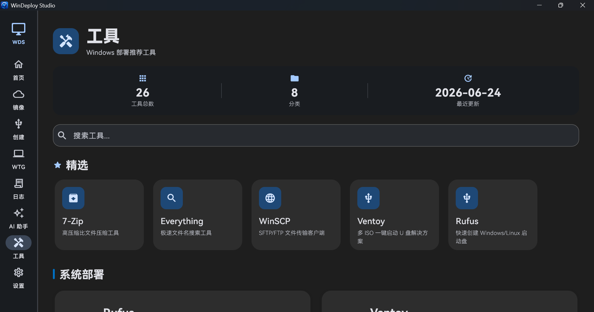

# WinDeploy Studio

Windows desktop toolkit for Windows/Linux installation media, portable To Go workspaces, native drive benchmarks, image resources, diagnostics, logs, and AI-assisted deployment help.


## Overview

WinDeploy Studio is a Flutter-based Windows desktop app for practical Windows and Linux deployment workflows. It combines Windows installation media creation, Linux ISOHybrid writing, Windows To Go, strict Linux To Go layout preflight for x64 Ubuntu/casper and Debian Live images, native drive testing, trusted image source navigation, deployment utilities, logs, and clear safety notices for advanced tools.

The project is distributed under the MIT License.

## Highlights

- **Installation Media Creator**
  - Create Windows installation USB drives and write bootable Linux ISOHybrid images.
  - Parse Windows ISO images and list available editions.
  - Select UEFI + GPT, UEFI + MBR, or Legacy BIOS for Windows media, with a preferred partition drive letter and custom volume label/icon.
  - Validate Linux ISOHybrid images before erasing the target disk.
  - Bind every destructive operation to the selected external disk and revalidate it immediately before writing.

- **To Go Workspace Creator**
  - Create portable Windows To Go workspaces.
  - Validate persistent Linux To Go layouts for x64 Ubuntu/casper and Debian Live ISOs. Creation is intentionally unavailable in this release until a fully reproducible, license-compliant ext4 creator is bundled.
  - Classify Linux To Go images when selected and again immediately before erasing the target. Ubuntu/casper requires x64 UEFI, casper kernel/initrd, Live payloads, and a patchable GRUB entry. Debian additionally requires `boot=live`, an NTFS-capable initrd, and its own `persistence` / `persistence.conf` protocol.
  - Reject unsupported distributions and unsafe Debian Live layouts before the target disk is changed; use Linux installation media for images outside the validated profiles.
  - Use a five-step image, disk, deployment, advanced-options, and summary workflow before execution.
  - Select UEFI + GPT, UEFI + MBR, or Legacy BIOS and deploy Windows directly or into dynamic/fixed VHD/VHDX files; incompatible image and mode combinations are blocked before writing.
  - Configure local-disk visibility, OOBE/Audit behavior, WinRE, UASP, CompactOS, WIMBoot, VHD/VHDX drive-letter repair, .NET Framework 3.5, and deployment drive letters where supported. UEFI deployments automatically use an NTFS Windows volume with a separate FAT32 EFI partition.
  - Optionally inject Windows INF drivers offline. When a compliant persistence creator is restored, supported Ubuntu/casper Linux To Go images can stage vetted Linux packages, matching kernel modules, or explicit scripts for first boot; this does not add support for arbitrary distributions.
  - Build a separate Windows boot partition and verify BCD, virtual-disk binding, and fallback UEFI boot files.
  - Revalidate disk identity, capacity, model, and bus type before destructive operations, preferring a reliable hardware serial number and failing closed when no stable identity is available.
  - During image application, the progress panel shows reliable elapsed time only.
  - Includes a small UI-only waiting game during long image application steps.

- **Native Drive Benchmark**
  - Uses unbuffered, write-through native Windows I/O instead of cached file-copy estimates.
  - Measures sequential read/write, 4K random read/write, real multi-thread scaling, mixed workloads, latency percentiles, and optional full-write stability.
  - Provides Quick, Standard, Extreme, and Full Write modes with live line charts, cache-behavior analysis, and practical To Go suitability guidance.
  - Automatically saves successful results for detail review, date filtering, two-run comparison, deletion, and CSV/JSON export.
  - Lets users choose one or more saved records when asking the AI whether a USB is suitable for a To Go workspace; selected metrics and their meanings are sent as reviewable plain text.
  - When no saved record is selected, the AI request recommends a Standard disk test before reaching a confident To Go suitability conclusion.
  - Uses an ownership marker for temporary data and removes only files created by the current test.

- **Disk Tools**
  - Collect read-only disk identity, health, reliability, lifetime, temperature, wear, and NVMe telemetry through a bounded native helper. Slow or unsupported storage queries become explicit unavailable values or collection warnings instead of blocking the whole scan.
  - Runs the bounded native helper from the elevated application process, so an unresponsive device produces a bounded failure instead of leaving the diagnostic screen stuck.
  - Repair UEFI or BIOS boot files only on a revalidated external, non-system disk, with preflight checks, a typed confirmation, BCD backup, no formatting, post-repair verification, and technical logs.

- **Image Center**
  - Separates **Official Microsoft Images**, **Community Editions**, and **Enterprise & LTSC Builds**.
  - Official Windows 10 and Windows 11 entries open Microsoft's official download pages in the system browser.
  - Community images keep the existing mirror-based flow with China and Global mirror choices.
  - Enterprise and LTSC entries are marked as expert-level deployment resources with clear source and language notices.
  - StarValleyX is shown only for Simplified Chinese and Traditional Chinese UI languages.
  - The CJK font pack is also Chinese-only. It is offered for Tiny10, Tiny11, and Windows X-Lite, never for StarValleyX.

- **Toolbox**
  - Curated deployment, diagnostics, recovery, hardware, network, and optimization utilities.
  - Tool safety levels: Beginner, Advanced, and Expert.
  - Professional notices before opening advanced, expert, or activation-related utilities.
  - Includes Microsoft Sysinternals Suite.

- **AI Assistant**
  - Built-in AI assistant for Windows deployment questions, log analysis, and troubleshooting suggestions.
  - For USB suitability questions and USB analysis, users can select multiple saved disk-test records. The request includes device data, run parameters, workload measurements, raw sample points, and metric definitions in plain text.
  - Displays a clear AI-generated content notice before use.
  - Supports custom OpenAI-compatible proxy endpoints.

- **Log Center**
  - Centralized logs for installation media creation, To Go workspaces, image operations, downloads, updates, AI, and errors.
  - Quick log browsing and folder access.

- **Windows 11 Interface And Navigation**
  - Uses one consistent Windows 11-inspired interface across supported Windows 10 and Windows 11 hosts.
  - Keeps the Flutter theme, native title bar, and responsive deployment navigation visually aligned without exposing redundant style selectors.
  - Groups primary navigation with clear visual dividers; choosing a primary destination from Disk Tools or test-history secondary pages opens that destination rather than retaining the previous subpage.

- **International UI**
  - Supports 11 languages:
    - Simplified Chinese
    - Traditional Chinese
    - English
    - Japanese
    - Korean
    - German
    - French
    - Spanish
    - Portuguese
    - Russian
    - Arabic

## Screenshots

These 18 screenshots follow the left navigation and the main workspace in order. They show the Home page first, then image and deployment workflows, disk utilities, logs, AI, tools, and settings.

### 1. Home

Home is the starting point of WinDeploy Studio. It combines the product title, Quick Start entry points, Workspace content, and project information without forcing users through a separate landing page.

<table>
  <tr>
    <td width="50%"><br><sub><b>1. Home</b> - Product title, Quick Start entry points, and the Workspace overview.</sub></td>
    <td width="50%"><br><sub><b>2. About</b> - Version, platform, license, repository, and project acknowledgement information.</sub></td>
  </tr>
</table>

### 2. Image Library

The Image Library keeps official images, community editions, enterprise and LTSC builds, and supporting resources clearly separated. Each entry communicates its source, purpose, language support, and suitability before a user follows a download link.

<table>
  <tr>
    <td><br><sub><b>3. Image Library</b> - Browse categorized image resources with clear source and suitability information.</sub></td>
  </tr>
</table>

### 3. Installation Media

Windows and Linux installation media are distinct workflows. Both make the selected ISO, target disk, validation result, and destructive action clear before writing begins.

<table>
  <tr>
    <td width="50%"><br><sub><b>4. Windows Installation Media</b> - Select and validate a Windows ISO, choose an edition and target disk, then create bootable installation media.</sub></td>
    <td width="50%"><br><sub><b>5. Linux Installation Media</b> - Validate a Linux ISOHybrid image, review the target disk, and write a bootable Linux installer.</sub></td>
  </tr>
</table>

### 4. To Go Workspaces

The To Go area creates portable Windows and Linux workspaces. It keeps the chosen image, target disk, compatibility checks, options, and confirmation summary together before a destructive operation starts.

<table>
  <tr>
    <td width="50%"><br><sub><b>6. Windows To Go</b> - Create a portable Windows workspace with image, disk, and deployment options shown in one workflow.</sub></td>
    <td width="50%"><br><sub><b>7. Linux To Go</b> - Create a portable Linux workspace after the selected image passes its supported-layout checks.</sub></td>
  </tr>
</table>

### 5. Disk Utilities

Disk features are separated into testing, the Disk Tools directory, diagnostics, and BCD/EFI boot repair. This makes it easier to identify the intended scope and risk of an operation before opening it.

<table>
  <tr>
    <td width="50%"><br><sub><b>8. Disk Test</b> - Run and review storage performance tests with saved test history.</sub></td>
    <td width="50%"><br><sub><b>9. Disk Tools</b> - Open the disk-utility directory and choose the appropriate storage workflow.</sub></td>
  </tr>
  <tr>
    <td width="50%"><br><sub><b>10. Disk Diagnostics</b> - Review available drive identity, health, and diagnostic information.</sub></td>
    <td width="50%"><br><sub><b>11. BCD/EFI Boot Repair</b> - Inspect and repair supported Windows boot configuration and EFI boot entries.</sub></td>
  </tr>
</table>

### 6. Log Center

Log Center collects output from installation media, To Go, image downloads, updates, AI requests, diagnostics, and errors. It provides both an overview and a focused detail view for reviewing completed work.

<table>
  <tr>
    <td width="50%"><br><sub><b>12. Log Center</b> - Browse log categories, sources, recent activity, warnings, and results.</sub></td>
    <td width="50%"><br><sub><b>13. Log Details</b> - Inspect a selected log entry and its structured operation output.</sub></td>
  </tr>
</table>

### 7. AI Assistant

The AI Assistant provides deployment guidance, troubleshooting suggestions, and log-analysis help. For USB analysis and To Go suitability questions, users can select multiple saved disk-test records; the sent plain-text context includes the device, test configuration, measurements, raw sample points, and metric definitions. If no record is available, the request recommends a Standard test. AI output remains advisory and should be verified before an important operation.

<table>
  <tr>
    <td><br><sub><b>14. AI Assistant</b> - Ask deployment questions, analyze selected disk-test records, and review the AI safety notice.</sub></td>
  </tr>
</table>

### 8. Tools

Tools groups useful Windows deployment, recovery, diagnostics, hardware, network, and optimization utilities. Tool cards include source information and clear safety levels for advanced or expert actions.

<table>
  <tr>
    <td><br><sub><b>15. Tools</b> - Browse curated utilities and their beginner, advanced, or expert suitability labels.</sub></td>
  </tr>
</table>

### 9. Settings

Settings centralizes application preferences, localization, local paths, update choices, version details, licensing, and acknowledgements. The three views below show the settings area as users move through it.

<table>
  <tr>
    <td width="33%"><br><sub><b>16. Settings - 1</b> - First view of the central settings area.</sub></td>
    <td width="33%"><br><sub><b>17. Settings - 2</b> - Second view of the central settings area.</sub></td>
    <td width="33%"><br><sub><b>18. Settings - 3</b> - Third view of the central settings area.</sub></td>
  </tr>
</table>

## System Requirements

| Item | Minimum | Recommended |
|:---|:---|:---|
| OS | Windows 10 1809 | Windows 11 |
| Architecture | x64 | x64 |
| RAM | 4 GB | 8 GB or more |
| Storage | 500 MB for app | Extra space for ISO files and deployment media |
| Runtime | WebView2 for built-in web pages | Latest WebView2 Runtime |

WinDeploy Studio requests administrator privileges when it starts. This gives all deployment, disk, and boot operations one elevated process and avoids opening separate elevation windows. If UAC is cancelled, the application does not start.

## Download

Download releases from:

[https://github.com/intelfans/WinDeployStudio/releases](https://github.com/intelfans/WinDeployStudio/releases)

## Build From Source

Prerequisites:

- Flutter SDK with Windows desktop support enabled
- Visual Studio Build Tools with C++ desktop workload
- Inno Setup 6 or 7 for installer builds
- PowerShell 7 recommended

Commands:

```powershell
flutter pub get
flutter analyze --no-fatal-infos
flutter build windows --release
```

Build the installer:

```powershell
.\scripts\build_installer.ps1
```

The installer output is created under:

```text
dist\windows\
```

## Project Structure

```text
lib/
  app/                  App shell, routing, theme
  core/
    config/             AI and app configuration
    constants/          App constants
    localization/       11-language UI strings
    services/           Disk safety, ISO, To Go, update, and mirror services
    utils/              Shared helpers
  features/
    ai_assistant/       AI assistant UI and services
    benchmark/          Native drive benchmark and charts
    benchmark_history/  Saved results, comparison, and export
    creator/            Windows/Linux installation media creator
    deployment/         Deployment plans, compatibility, Windows policies
    disk_tools/         Read-only diagnostics and guarded boot repair
    home/               Quick Start and project information
    logs/               Log center
    mirror/             Image center
    settings/           App settings
    tools/              Toolbox
    update/             Update flow
    wtg/                Windows/Linux To Go creator
  shared/
    webview/            Built-in web view and download UI
    widgets/            Responsive deployment shell and shared controls
```

## Safety And Licensing

WinDeploy Studio does not provide Windows licenses, product keys, activation services, or authorization bypass mechanisms. Users are responsible for complying with all applicable software license agreements.

Activation-related utilities are presented as third-party resources for educational, testing, troubleshooting, research, and system administration purposes. For production, commercial use, or long-term deployment, use valid licenses from the software vendor.

Windows, Microsoft, Sysinternals, Intel, and other product names, trademarks, logos, and external resources remain the property of their respective owners. WinDeploy Studio is not affiliated with Microsoft Corporation or Intel Corporation.

## Third-Party Tools

The current release does not redistribute `mke2fs.exe`, e2fsprogs, Cygwin, or any other ext4 creator. A previously evaluated Google/AOSP `mke2fs.exe` was removed because this project did not possess its complete corresponding source, all statically linked dependencies, and reproducible build inputs required for GPLv2 redistribution.

The Linux To Go creator retains separate layout contracts for future compliant tooling: Ubuntu/casper uses a FAT32 boot/persistence partition, an NTFS Live-data partition, an ext4 `writable` image, and the `persistent` boot argument. Debian Live uses an ext4 `persistence` image containing `/persistence.conf` with `/ union`, plus the `persistence` boot argument. Both profiles use `live-media=/dev/disk/by-uuid/...` for the NTFS Live data partition and reject images that do not prove the required boot contract.

Any future bundled ext4 tool must remain a separate command-line component and ship with its exact corresponding source, build scripts, static dependency notices, license texts, an immutable source URL, and a real three-year source offer. See [tools/e2fsprogs/README.md](tools/e2fsprogs/README.md) and [THIRD_PARTY_NOTICES.md](THIRD_PARTY_NOTICES.md).

## Roadmap

The implemented portions of the original items 4-9 are documented above and are no longer roadmap promises. The remaining work is:

- Restore Linux To Go creation only after shipping a reproducible, license-compliant ext4 creator, then validate it with real boot and persistence tests for the supported x64 Ubuntu/casper and Debian Live profiles. WinDeploy Studio does not support arbitrary Linux distributions for Linux To Go.
- Expand offline Windows optional-feature selection beyond the currently implemented .NET Framework 3.5 path.
- Add update-source selection with Oracle Cloud as the recommended high-speed source and GitHub Releases as the fallback. GitHub is currently the only update source.

## Special Thanks

WinDeploy Studio would like to thank the following people and communities for their valuable feedback, testing, ideas, inspiration, and support.

- **Star__P** - Early feedback, testing, and project discussions
- **Timme** - Detailed international user feedback, trust and usability recommendations, Microsoft source suggestions, and community review
- **Microsoft Sysinternals Team** - Inspiration from Microsoft's diagnostic and troubleshooting tools
- **Open Source Community** - Documentation, bug reports, testing, translations, and suggestions

## License

MIT License. See [LICENSE](LICENSE).

---

# WinDeploy Studio 中文说明

WinDeploy Studio 是一款运行于 Windows 的现代化部署工具，面向 Windows 安装盘、Linux ISOHybrid 写盘、Windows To Go、x64 Ubuntu/casper 与 Debian Live 的严格 Linux To Go 布局预检、原生磁盘测试、镜像资源、工具箱、日志查看和 AI 辅助排障等场景。

## 核心功能

- **安装盘创建工具**
  - 从 ISO 创建 Windows 安装 U 盘，或写入可启动的 Linux ISOHybrid 镜像。
  - 自动解析 Windows ISO，列出可安装版本。
  - Windows 安装盘可选择 UEFI + GPT、UEFI + MBR 或 Legacy BIOS，并可指定分区盘符、自定义卷标和图标。
  - 在擦除目标磁盘前验证 Linux ISOHybrid 结构。
  - 每次破坏性操作都绑定到用户选择的外接磁盘，并在写入前再次核验。

- **To Go 工作环境创建工具**
  - 创建便携式 Windows To Go 工作空间。
  - 验证 x64 Ubuntu/casper 与 Debian Live 的持久化 Linux To Go 布局。本发行版在提供完全可复现、许可证合规的 ext4 创建工具前，刻意不开放创建功能。
  - 选择镜像时及擦除目标磁盘前都会分类检查 LTG 镜像；Ubuntu/casper 布局必须具备 x64 UEFI、casper 内核/initrd、Live 文件系统和可安全注入持久化参数的 GRUB 启动项。Debian 还必须具备 `boot=live`、支持 NTFS 的 initrd 与独立的 `persistence` / `persistence.conf` 协议。
  - 不受支持的发行版与不安全的 Debian Live 布局会在修改目标磁盘前被拒绝；验证范围外的镜像请使用 Linux 安装盘。
  - 执行前经过镜像、磁盘、部署方式、高级选项和配置摘要五步流程。
  - 可选择 UEFI + GPT、UEFI + MBR 或 Legacy BIOS，并将 Windows 直接部署到分区或动态/固定 VHD、VHDX；不兼容的镜像与模式组合会在写盘前阻止。
  - 在支持的组合中配置本地磁盘可见性、OOBE/Audit、WinRE、UASP、CompactOS、WIMBoot、VHD/VHDX 盘符修复、.NET Framework 3.5 和部署盘符。UEFI 部署会自动采用 NTFS Windows 卷与独立 FAT32 EFI 分区。
  - 可选离线注入 Windows INF 驱动。待恢复合规的持久化创建工具后，受支持的 Ubuntu/casper Linux To Go 可暂存经过校验的 Linux 软件包、匹配内核模块或显式脚本，在首次启动时处理；这不代表支持任意发行版。
  - 为 Windows To Go 创建独立启动分区，并验证 BCD、虚拟磁盘绑定和 UEFI 回退启动文件。
  - 在清盘前重新核验磁盘号、容量、型号与总线类型，优先使用可靠硬件序列号；无法建立稳定物理身份时拒绝清盘。
  - 应用镜像阶段只显示可靠的已用时间。
  - 长时间写入时提供一个纯 UI 小游戏用于打发等待时间，不影响创建流程。

- **原生磁盘测试**
  - 使用 Windows 原生无缓冲、写穿透 I/O，而不是容易受缓存影响的文件复制测速。
  - 测量顺序读写、4K 随机读写、真实多线程扩展、混合负载、延迟分位数，并可选测试全盘写入稳定性。
  - 提供快速、标准、极限、全盘写入四种模式，配合实时折线图、缓存行为分析和面向 To Go 的实用评级建议。
  - 成功结果会自动保存，可查看详情、按日期筛选、比较两次结果、删除并导出 CSV/JSON。
  - 在询问 AI 某个 USB 是否适合做随身系统，或使用“分析 USB”时，可选择一条或多条保存的记录；设备信息、测试参数、测量数据和指标含义会以纯文本一并发送。
  - 未选择已保存记录时，发给 AI 的请求会建议先完成一次标准磁盘测试，再对随身系统适用性作出有把握的判断。
  - 测试文件带独立所有权标记，仅清理由本次测试创建的数据。

- **磁盘工具**
  - 通过带超时边界的原生 helper 以只读方式收集磁盘身份、健康、可靠性、寿命、温度、磨损和 NVMe 遥测；慢速或不受支持的查询会明确显示为不可用或采集警告，不会阻塞整个扫描。
  - 从已提升权限的应用进程中运行带超时边界的原生 helper；设备无响应时会给出受限失败结果，不会让诊断界面一直卡住。
  - 仅对重新核验后的外接非系统磁盘修复 UEFI/BIOS 启动文件，执行前经过预检、输入确认和 BCD 备份；不格式化磁盘，并在完成后验证结果和保存技术日志。

- **镜像中心**
  - 区分 **Microsoft 官方镜像**、**社区版本** 与 **企业版 / LTSC 构建**。
  - Windows 10 / Windows 11 官方条目始终跳转 Microsoft 官方网站，并使用系统默认浏览器打开。
  - 社区镜像继续保留中国镜像和全球镜像选择流程。
  - 企业版与 LTSC 镜像标记为专家级部署资源，并提供清晰的来源与语言提示。
  - StarValleyX 仅在简体中文和繁体中文界面中显示。
  - CJK 字体包同样只在简体中文和繁体中文界面显示，仅向 Tiny10、Tiny11 和 Windows X-Lite 提供，不向 StarValleyX 提示。

- **工具箱**
  - 收录部署、诊断、恢复、硬件、网络、优化等工具。
  - 工具分为入门、高级、专家级三个安全等级。
  - 高级、专家级和激活相关工具打开前显示专业提示。
  - 新增 Microsoft Sysinternals Suite。

- **AI 助手**
  - 用于 Windows 部署问答、日志分析和排障建议。
  - 对“这个 USB 适合制作随身系统吗？”和“分析 USB”支持多选已保存的磁盘测试记录，以纯文本发送设备数据、运行参数、工作负载、采样点和指标解释。
  - 使用前显示 AI 内容提示。
  - 支持自定义 OpenAI 兼容代理端点。

- **日志中心**
  - 汇总安装盘、随身系统、镜像、下载、更新、AI 和错误日志。
  - 支持分类查看和快速打开日志目录。

- **Windows 11 界面与导航**
  - 在受支持的 Windows 10/11 主机上统一使用 Windows 11 风格界面。
  - Flutter 主题、原生标题栏和响应式部署导航保持一致，不再提供没有必要的外观模式切换。
  - 左侧主导航用清晰的分隔线分组；从磁盘工具或测试历史等二级页面选择主导航时，会直接打开所选目标页，不再保留之前的二级页面。

- **多语言**
  - 支持 11 种界面语言：简体中文、繁体中文、英语、日语、韩语、德语、法语、西班牙语、葡萄牙语、俄语、阿拉伯语。

## 界面截图

以下 18 张截图按左侧导航和主工作区的使用顺序排列：从首页出发，依次展示镜像与部署流程、磁盘工具、日志、AI、工具箱和设置页。

### 1. 首页

首页是 WinDeploy Studio 的起点，将产品标题、快速开始入口、工作区内容和项目信息放在同一处，不需要再经过单独的介绍页。

<table>
  <tr>
    <td width="50%"><br><sub><b>1. 首页</b> - 展示产品标题、快速开始入口和工作区概览。</sub></td>
    <td width="50%"><br><sub><b>2. 关于</b> - 展示版本、平台、许可证、GitHub 仓库和项目鸣谢等信息。</sub></td>
  </tr>
</table>

### 2. 镜像库

镜像库将官方镜像、社区版本、企业版与 LTSC 构建和辅助资源清晰分开。用户在打开下载链接前，可以先确认来源、用途、语言支持和适用级别。

<table>
  <tr>
    <td><br><sub><b>3. 镜像库</b> - 按类别浏览镜像资源，并在下载前确认来源和适用性。</sub></td>
  </tr>
</table>

### 3. 安装盘制作

Windows 与 Linux 安装盘是两个独立流程。两者都会在写入前明确显示所选 ISO、目标磁盘、验证结果以及将要执行的破坏性操作。

<table>
  <tr>
    <td width="50%"><br><sub><b>4. Windows 安装盘</b> - 选择并验证 Windows ISO，选择版本与目标磁盘，然后创建可启动安装介质。</sub></td>
    <td width="50%"><br><sub><b>5. Linux 安装盘</b> - 验证 Linux ISOHybrid 镜像，核对目标磁盘，并写入可启动 Linux 安装盘。</sub></td>
  </tr>
</table>

### 4. To Go 工作环境

To Go 区域用于创建便携的 Windows 与 Linux 工作环境。在任何破坏性操作开始前，它会将所选镜像、目标磁盘、兼容性检查、可选项和确认摘要集中展示。

<table>
  <tr>
    <td width="50%"><br><sub><b>6. Windows To Go</b> - 在一个流程中设置便携 Windows 工作区的镜像、磁盘和部署选项。</sub></td>
    <td width="50%"><br><sub><b>7. Linux To Go</b> - 仅在所选 Linux 镜像通过受支持布局检查后创建便携工作环境。</sub></td>
  </tr>
</table>

### 5. 磁盘工具

磁盘功能分为磁盘测试、磁盘工具主目录、磁盘诊断和 BCD/EFI 启动修复，帮助用户在打开功能前先判断操作范围与风险。

<table>
  <tr>
    <td width="50%"><br><sub><b>8. 磁盘测试</b> - 运行并查看存储性能测试，测试记录可保存到历史中。</sub></td>
    <td width="50%"><br><sub><b>9. 磁盘工具</b> - 打开磁盘工具主目录，选择对应的存储操作流程。</sub></td>
  </tr>
  <tr>
    <td width="50%"><br><sub><b>10. 磁盘诊断</b> - 查看可用的硬盘身份、健康状态和诊断信息。</sub></td>
    <td width="50%"><br><sub><b>11. BCD/EFI 启动修复</b> - 检查并修复受支持的 Windows 启动配置与 EFI 启动项。</sub></td>
  </tr>
</table>

### 6. 日志中心

日志中心汇总安装盘制作、随身系统、镜像下载、更新检查、AI 请求、诊断和错误信息等输出，同时提供概览和详情两种查看方式，方便回顾已完成的工作。

<table>
  <tr>
    <td width="50%"><br><sub><b>12. 日志中心</b> - 按类别、来源、最近活动、警告和结果浏览日志。</sub></td>
    <td width="50%"><br><sub><b>13. 日志详情</b> - 查看选中日志及其结构化操作输出。</sub></td>
  </tr>
</table>

### 7. AI 助手

AI 助手用于部署问答、排障建议和日志分析。对 USB 分析和随身系统适用性问题，用户可多选已保存的磁盘测试记录；发送的纯文本上下文包括设备信息、测试配置、测量结果、原始采样点和指标解释。没有可用记录时，请求会建议先运行一次标准测试。AI 输出仅供辅助，重要操作前仍应自行核实。

<table>
  <tr>
    <td><br><sub><b>14. AI 助手</b> - 提出部署问题，分析所选磁盘测试记录，并查看 AI 使用提示。</sub></td>
  </tr>
</table>

### 8. 工具箱

工具箱收录部署、恢复、诊断、硬件、网络和优化等常用工具。工具卡片会展示来源信息和明确的入门、高级或专家级适用标签。

<table>
  <tr>
    <td><br><sub><b>15. 工具箱</b> - 浏览精选工具及其入门、高级或专家级适用标签。</sub></td>
  </tr>
</table>

### 9. 设置

设置页集中管理应用偏好、本地化、路径、更新选择、版本信息、许可证和鸣谢内容。以下三张图展示用户在设置区域中的不同视图。

<table>
  <tr>
    <td width="33%"><br><sub><b>16. 设置 - 1</b> - 设置区域的第一个视图。</sub></td>
    <td width="33%"><br><sub><b>17. 设置 - 2</b> - 设置区域的第二个视图。</sub></td>
    <td width="33%"><br><sub><b>18. 设置 - 3</b> - 设置区域的第三个视图。</sub></td>
  </tr>
</table>

## 系统要求

| 项目 | 最低要求 | 建议配置 |
|:---|:---|:---|
| 操作系统 | Windows 10 1809 | Windows 11 |
| 架构 | x64 | x64 |
| 内存 | 4 GB | 8 GB 或更高 |
| 存储空间 | 应用本体约 500 MB | 为 ISO 文件和部署介质预留额外空间 |
| 运行时 | 内置网页需要 WebView2 | 最新版 WebView2 Runtime |

WinDeploy Studio 会在启动时请求管理员权限。这样部署、磁盘和启动修复操作都在同一个已提升权限的进程内执行，不会再打开单独的提权窗口。若取消 UAC 授权，应用不会启动。

## 下载

请从 GitHub Releases 下载：

[https://github.com/intelfans/WinDeployStudio/releases](https://github.com/intelfans/WinDeployStudio/releases)

## 从源码构建

前置要求：

- 已启用 Windows 桌面支持的 Flutter SDK
- 安装带 C++ 桌面开发工作负载的 Visual Studio Build Tools
- 构建安装包需要 Inno Setup 6 或 7
- 建议使用 PowerShell 7

```powershell
flutter pub get
flutter analyze --no-fatal-infos
flutter build windows --release
```

构建安装包：

```powershell
.\scripts\build_installer.ps1
```

安装包输出目录：

```text
dist\windows\
```

## 项目结构

```text
lib/
  app/                  应用外壳、路由和主题
  core/
    config/             AI 与应用配置
    constants/          应用常量
    localization/       11 种界面语言
    services/           磁盘安全、ISO、随身系统、更新和镜像服务
    utils/              通用工具函数
  features/
    ai_assistant/       AI 助手界面与服务
    benchmark/          原生磁盘测试与折线图
    benchmark_history/  测试历史、比较与导出
    creator/            Windows / Linux 安装盘创建工具
    deployment/         部署计划、兼容性和 Windows 策略
    disk_tools/         只读诊断和受保护的启动修复
    home/               快速开始与项目信息
    logs/               日志中心
    mirror/             镜像中心
    settings/           应用设置
    tools/              工具箱
    update/             更新流程
    wtg/                Windows / Linux To Go 创建工具
  shared/
    webview/            内置网页和下载界面
    widgets/            响应式部署外壳和共享控件
```

## 安全与许可声明

WinDeploy Studio 基于 MIT License 分发。

本项目不提供 Windows 授权、产品密钥、激活服务或绕过授权机制。用户需自行确保遵守 Microsoft 及其他软件厂商的许可协议。

第三方软件、商标、Logo 和外部资源归其各自所有者所有。WinDeploy Studio 与 Microsoft Corporation 或 Intel Corporation 无官方隶属关系。

## 第三方工具说明

当前发行版不会再分发 `mke2fs.exe`、e2fsprogs、Cygwin 或其他 ext4 创建工具。此前评估过的 Google/AOSP `mke2fs.exe` 已被移除，因为本项目没有持有 GPLv2 再分发所需的完整对应源码、全部静态链接依赖和可复现构建输入。

Linux To Go 创建器为未来合规工具保留了两套独立布局契约：Ubuntu/casper 使用 FAT32 启动/持久化分区、NTFS Live 数据分区、ext4 `writable` 镜像与 `persistent` 启动参数；Debian Live 使用包含 `/persistence.conf`（内容为 `/ union`）的 ext4 `persistence` 镜像和 `persistence` 启动参数。两类布局都会用 `live-media=/dev/disk/by-uuid/...` 指向 NTFS Live 数据分区，并拒绝无法证明所需启动契约的镜像。

未来如需随程序内置 ext4 工具，它必须保持为独立命令行组件，并同时提供精确对应源码、构建脚本、静态依赖声明、许可证文本、不可变源码 URL 和真实的三年源码提供承诺。详见 [tools/e2fsprogs/README.md](tools/e2fsprogs/README.md) 与 [THIRD_PARTY_NOTICES.md](THIRD_PARTY_NOTICES.md)。

## 未来规划

原规划④-⑨中已经落地的部分已写入上方“核心功能”，不再作为未来承诺。当前真实未完成项为：

- 在提供可复现、许可证合规的 ext4 创建工具后恢复 Linux To Go 创建功能，并对受支持的 x64 Ubuntu/casper 与 Debian Live 配置执行真实启动和持久化测试。WinDeploy Studio 不支持任意 Linux 发行版的 Linux To Go。
- 将离线 Windows 可选功能扩展到当前已实现的 .NET Framework 3.5 之外。
- 加入更新源选择：甲骨文云作为推荐高速源，GitHub Releases 作为备用源；当前只有 GitHub 更新源。

## 特别鸣谢

WinDeploy Studio 感谢以下个人和社区提供的反馈、测试、想法、灵感与支持。

- **Star__P** - 早期反馈、测试和项目讨论
- **Timme** - 细致的国际用户反馈、信任与易用性建议、Microsoft 官方来源建议和社区审阅
- **Microsoft Sysinternals Team** - 来自 Microsoft 诊断与故障排查工具的启发
- **Open Source Community** - 文档、错误报告、测试、翻译和建议

## 许可证

MIT License，详见 [LICENSE](LICENSE)。
